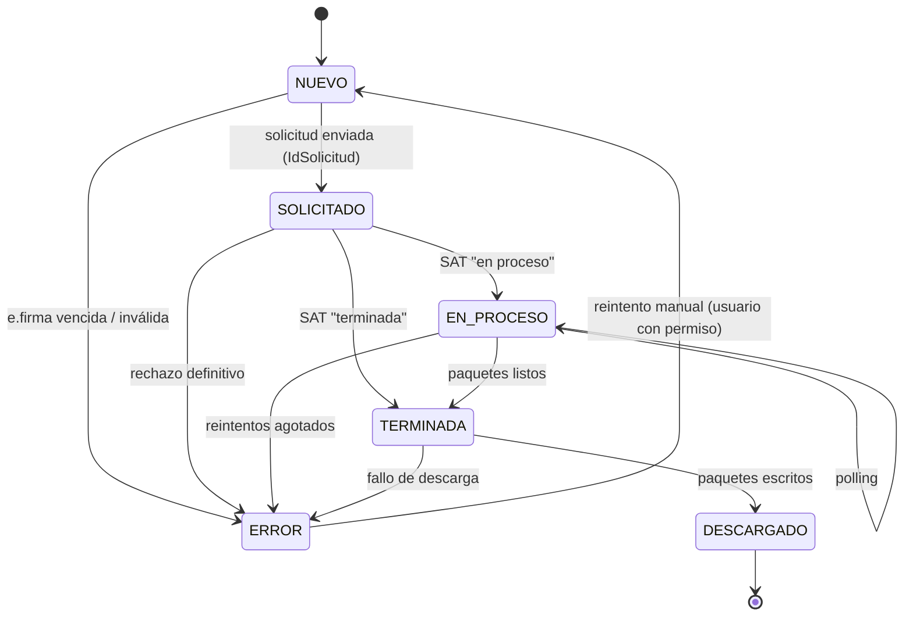

# 01 — SRS · Especificación de Requisitos de Software

| Campo | Valor |
|---|---|
| Proyecto | Hub CFDI — Plataforma Web (v2.0) |
| Documento | 01 — SRS |
| Versión | 2.0 |
| Fecha | 2026-07-27 |
| Estándar | ISO/IEC/IEEE 29148:2018 |
| Depende de | [`00_auditoria_fuentes.md`](../00-fuentes/00_auditoria_fuentes.md) · [`inventario_funcional.md`](../00-fuentes/inventario_funcional.md) · [`ADR-003`](../02-arquitectura/ADR/ADR-003_pivote_web.md) |

> *v2.0 reemplaza al SRS v1.0 de escritorio (archivado). Conserva el dominio de descarga/validación/resguardo y añade la capa de plataforma (auth, permisos, bóveda, sincronización, vigilancia, notificaciones). Los módulos están ordenados por las prioridades de David: seguridad → núcleo → complementos → futuro.*

---

## 1. Introducción

### 1.1 Propósito

Especifica el comportamiento observable del MVP de la plataforma Hub CFDI y delimita explícitamente lo que se proyecta a futuro. Es la fuente de verdad funcional para el demo (doc 09), el contrato de API (doc 05) y el backend (Fase 2).

### 1.2 Alcance del MVP

El MVP se define por las prioridades rectoras:

- **Prioridad 1 — Seguridad y autenticación:** autenticación Firebase, roles y permisos por empresa, bóveda de e.firmas, bitácora de operaciones sensibles.
- **Prioridad 2 — Núcleo heredado de escritorio:** gestión de empresas (multi-RFC), carga/validación de e.firma, descarga masiva asíncrona reanudable (emitidos/recibidos, CFDI/metadata), validación de estatus sin captcha, resguardo con nomenclatura configurable e índice local de comprobantes.
- **Prioridad 3 — Complementos de MVP:** sincronización diaria automática por empresa, descarga manual bajo demanda, monitoreo de descargas, listados con filtros y búsqueda, alerta de cancelaciones tardías, control EFOS 69-B con cruce diario, notificaciones por correo configurables, export a Excel.

**Explícitamente fuera del MVP (proyectado a futuro, §8):** conciliación REP, reportes de nómina, DIOT, CSF/Opinión de Cumplimiento, dashboards estadísticos, motor fiscal IVA/ISR, conciliación del precargado, validación completa contra guías de llenado, gestión de suscripción/planes, integración CONTPAQi, export PDF masivo, API pública/SSO/app móvil.

**Supuesto de operación (H-05):** plataforma **interna** del despacho. Si D4 cambia a comercialización, se levanta un ADR con el delta legal y de producto.

### 1.3 Definiciones

Se heredan las definiciones del SRS v1.0 (CFDI, SAT, FIEL/e.firma, RFC, UUID/folio fiscal, folio interno, WS de Descarga Masiva v1.5, solicitud, paquete, job, metadata, ventana, Signer, LFPDPPP). Nuevas:

| Término | Definición |
|---|---|
| Empresa | Cliente/contribuyente (RFC) administrado en la plataforma. Entidad central del aislamiento. |
| Bóveda | Almacén cifrado de e.firmas en el servidor (envelope encryption). |
| EFOS | Empresas que Facturan Operaciones Simuladas — lista del art. 69-B CFF publicada por el SAT. |
| Cancelación tardía | CFDI de un mes anterior que aparece cancelado en el mes en curso. |
| Sincronización | Job de descarga automática programada (diaria) por empresa. |

### 1.4 Stack tecnológico de referencia

| Capa | Tecnología | Versión |
|---|---|---|
| Frontend | React + Vite + TS + Tailwind + TanStack Query | 19 / 6 / 5.x / 4 / 5 |
| API | FastAPI (Python) | 3.11+ |
| Workers/cola/scheduler | Celery + Redis (beat) | 5 / 7 |
| Motor SAT | `satcfdi` | 26.x fijada |
| BD | MySQL InnoDB utf8mb4 | 8.x |
| Auth | Firebase Authentication | — |

---

## 2. Descripción general

### 2.1 Perspectiva del producto

SPA React contra API REST FastAPI. La API delega todo trabajo SAT a workers Celery que importan el núcleo `sat_hub` (heredado de v1.0). MySQL es la fuente de verdad de datos y permisos; Firebase solo provee identidad; el SAT es la fuente de verdad fiscal. La e.firma vive cifrada en la bóveda y solo se descifra en memoria del worker.

### 2.2 Roles de usuario

| Rol | Descripción | Privilegios clave |
|---|---|---|
| Administrador | Administra la plataforma | Todo: usuarios, permisos, empresas, bóveda, configuración, bitácora |
| Operador | Contador/auxiliar que opera empresas asignadas | Sobre sus empresas: e.firmas (alta/reemplazo), descargas, validaciones, resguardo, notificaciones |
| Consulta | Acceso de solo lectura a empresas asignadas | Listados, monitoreo y export; sin bóveda ni descargas |

Un usuario puede tener rol distinto por asignación global, pero el acceso a datos siempre está limitado por sus permisos usuario↔empresa. La visualización de CFDI de nómina será restringible por usuario cuando exista el módulo (futuro, F-02).

### 2.3 Suposiciones y dependencias

- Operación interna del despacho (H-05); un solo despliegue.
- Cada empresa aporta su e.firma vigente y autoriza su custodia en la plataforma.
- El WS del SAT v1.5 disponible; sus reglas (R1–R6 de v1.0) son configuración versionada.
- Lista 69-B pública del SAT accesible para descarga periódica (vía `satcfdi`).
- Servidor con TLS, backups cifrados y correo saliente (SMTP/SES) disponibles.

---

## 3. Requisitos funcionales

Formato: **RF-[MÓDULO]-[n]** — Nombre. Descripción. **Criterio de aceptación.**

### 3.1 Prioridad 1 — Autenticación y sesión (RF-AUTH)

**RF-AUTH-01** — Inicio de sesión con Firebase
El acceso requiere autenticación vía Firebase Auth; el frontend adjunta el ID token como Bearer y el backend lo verifica (firma, expiración, revocación) en cada petición.
**Criterio:** una petición sin token o con token inválido/expirado recibe 401; con token válido, el backend resuelve el usuario local por `firebase_uid`.

**RF-AUTH-02** — Aprovisionamiento controlado de usuarios
Solo un Administrador da de alta usuarios (correo → invitación); no hay auto-registro. Un usuario Firebase sin registro local no accede a nada.
**Criterio:** un token válido de un uid no registrado recibe 403; el alta crea el usuario local con rol y queda en bitácora.

**RF-AUTH-03** — Roles y permisos por empresa
Cada usuario tiene un rol (admin/operador/consulta) y un conjunto explícito de empresas permitidas. Toda lectura/escritura de datos de una empresa verifica ese permiso en el backend.
**Criterio:** un usuario sin permiso sobre la empresa X recibe 403 al pedir cualquier recurso de X (IDOR negativo, doc 06); conceder/revocar permisos es acción de admin con bitácora.

**RF-AUTH-04** — Cierre y revocación de sesión
La plataforma permite cerrar sesión y a un admin desactivar un usuario; los tokens de un usuario desactivado dejan de ser aceptados.
**Criterio:** tras desactivación, la siguiente petición del usuario recibe 403 aunque el token siga vigente en Firebase.

### 3.2 Prioridad 1 — Bóveda de e.firmas (RF-BOV)

**RF-BOV-01** — Alta de e.firma en bóveda
Un Operador/Admin con permiso sobre la empresa sube `.cer`, `.key` y contraseña por canal TLS. El backend valida que la e.firma abre (construye el `Signer`), que corresponde al RFC de la empresa y que está vigente; luego cifra `.key` y contraseña (AES-256-GCM, envelope) y persiste. La contraseña nunca se almacena en claro ni se registra en logs.
**Criterio:** tras el alta, en la BD solo existen blobs cifrados + metadatos (RFC, serie, vigencia); la respuesta de API nunca devuelve material de llave; el alta queda en bitácora.

**RF-BOV-02** — Validación de vigencia y alertas
El sistema registra `not_before`/`not_after` del certificado, bloquea el encolado de descargas con e.firma vencida y notifica cuando la vigencia entra al umbral configurable (default 15 días).
**Criterio:** con e.firma vencida el job no sale de `NUEVO` y el motivo es visible; la alerta de por-vencer se envía una sola vez por umbral.

**RF-BOV-03** — Uso auditado y acotado
El material descifrado solo existe en memoria del worker para construir el `Signer` durante un job; cada descifrado escribe bitácora (quién/qué job/cuándo).
**Criterio:** la bitácora contiene un evento por cada uso de la bóveda; ninguna búsqueda en logs/BD/Redis revela material de llave o contraseñas.

**RF-BOV-04** — Reemplazo y eliminación
La e.firma de una empresa puede reemplazarse (renovación) o eliminarse; eliminar la e.firma no borra el histórico de descargas ni comprobantes.
**Criterio:** tras eliminar, no queda blob cifrado de esa e.firma; los jobs históricos permanecen; ambas acciones en bitácora.

### 3.3 Prioridad 1 — Bitácora (RF-BIT)

**RF-BIT-01** — Bitácora append-only de operaciones sensibles
Alta/baja/cambios de usuarios y permisos, operaciones de bóveda, borrados, cambios de configuración y disparos manuales de descarga escriben bitácora (actor, acción, entidad, timestamp, detalle) dentro de la misma transacción.
**Criterio:** si la escritura de bitácora falla, la operación se revierte; la bitácora no tiene UPDATE/DELETE (solo INSERT y SELECT); consultable por Admin con filtros.

### 3.4 Prioridad 2 — Gestión de empresas (RF-EMP)

**RF-EMP-01** — Alta y edición de empresa
Alta con nombre/razón social, RFC (validado en formato) y parámetros de resguardo. RFC único en la instancia.
**Criterio:** RFC duplicado o malformado se rechaza; alta/edición en bitácora.

**RF-EMP-02** — Baja lógica
Una empresa se desactiva sin borrar su historial (jobs, comprobantes, bitácora).
**Criterio:** empresa inactiva no acepta nuevas descargas ni sync; su historial sigue consultable para usuarios con permiso.

**RF-EMP-03** — Aislamiento por empresa
Todos los datos (e.firma, jobs, comprobantes, notificaciones, archivos) están ligados a una empresa; no existe ruta de código que cruce datos entre empresas sin permiso.
**Criterio:** verificado por los casos IDOR del doc 06.

### 3.5 Prioridad 2 — Descarga masiva (RF-DESC) *(hereda v1.0)*

**RF-DESC-01** — Troceo de rangos (R1/R2): ventanas ≤ 12 meses, recorte a ~5 años; un job por ventana. **Criterio:** rango de 3 años ⇒ ≥3 jobs contiguos sin traslape; fecha más antigua que el tope se ajusta e informa.

**RF-DESC-02** — Tipo y modalidad (R5): `tipo ∈ {emitido, recibido}`, `solicitud ∈ {CFDI, METADATA}`; el método `satcfdi` corresponde al tipo. **Criterio:** verificado por prueba de integración por tipo.

**RF-DESC-03** — Ciclo asíncrono persistido (R4): workers ejecutan `solicitar → verificar (polling) → descargar`; cada transición se persiste antes de continuar conforme a la máquina de estados (§4). **Criterio:** el job recorre `NUEVO→SOLICITADO→EN_PROCESO→TERMINADA→DESCARGADO` con timestamps en BD.

**RF-DESC-04** — Reanudabilidad: reinicios de worker/deploys no pierden ni duplican trabajo; `id_solicitud` inmutable. **Criterio:** matar el worker en `EN_PROCESO` y reiniciar continúa con el mismo `id_solicitud`.

**RF-DESC-05** — Tolerancia a fallos: reintentos con backoff configurable; agotados ⇒ `ERROR` con mensaje; re-encolable manualmente. **Criterio:** fallo transitorio simulado se recupera; el rechazo por límite de solicitudes del SAT se trata como reintentable.

**RF-DESC-06** — Almacenamiento de paquetes: los `.zip` se escriben en el almacenamiento de la empresa (fuera del webroot), sin sobrescribir. **Criterio:** tras `DESCARGADO`, archivos presentes y conteo == `paquetes`.

### 3.6 Prioridad 2 — Validación de estatus (RF-VAL) *(hereda v1.0)*

**RF-VAL-01** — Estatus programático sin captcha vía `SAT.status()`; resultado con timestamp. **Criterio:** estatus coincide con el SAT y persiste `estatus_verificado_at`.
**RF-VAL-02** — Validación en lote por empresa/job con tolerancia a fallos parciales. **Criterio:** un CFDI no consultable no aborta el lote.
**RF-VAL-03** — Re-verificación programada y bajo demanda (base de RF-RIES-01). **Criterio:** re-verificar actualiza estatus y timestamp; puede listarse lo no verificado en N días.

### 3.7 Prioridad 2 — Resguardo e índice (RF-RES) *(hereda v1.0)*

**RF-RES-01** — Parseo e indexado: los XML de los paquetes generan un registro por CFDI en `comprobantes` (UUID, folio, emisor/receptor, razón social, total, fecha, tipo, estatus, ruta). **Criterio:** conteo XML == filas indexadas; `UNIQUE(empresa, uuid)`.
**RF-RES-02** — Nomenclatura configurable por plantilla con tokens (`{razon_social}`, `{uuid_last4}`, `{folio}`, `{estatus}`); default pendiente D1. **Criterio:** cambiar plantilla no requiere código.
**RF-RES-03** — Comprobante de validación: registro estructurado siempre; PDF opcional por bandera (pendiente D2). **Criterio:** con bandera activa existe `comprobante_path`.

### 3.8 Prioridad 3 — Sincronización y monitoreo (RF-SYNC)

**RF-SYNC-01** — Sincronización diaria automática
Cada empresa activa con e.firma vigente tiene una sincronización programada (Celery beat) que descarga los CFDI del periodo reciente (emitidos y recibidos, CFDI y metadata) y actualiza estatus.
**Criterio:** la corrida nocturna crea/ejecuta jobs por empresa sin intervención; su resultado es visible en el monitoreo; una empresa con e.firma vencida se omite y notifica.

**RF-SYNC-02** — Descarga manual bajo demanda
Un usuario con permiso lanza una descarga por rango/tipo desde la UI, sin esperar a la corrida diaria.
**Criterio:** el disparo queda en bitácora y el job aparece de inmediato en el monitoreo.

**RF-SYNC-03** — Monitoreo de descargas
Vista del estado de todos los jobs (por empresa, estado, fechas), avance de la corrida diaria y errores recientes.
**Criterio:** la vista refleja la máquina de estados en tiempo casi real (refresco por polling de la SPA).

### 3.9 Prioridad 3 — Vigilancia de riesgo (RF-RIES)

**RF-RIES-01** — Alerta de cancelaciones tardías
El sistema detecta CFDI de meses anteriores cuyo estatus cambió a `cancelado` en el mes en curso, y lo notifica.
**Criterio:** un cambio vigente→cancelado con `fecha_emision` de un mes previo genera evento y notificación una sola vez.

**RF-RIES-02** — Control EFOS 69-B
El sistema descarga periódicamente la lista 69-B (vía `satcfdi`), la cruza contra los RFC emisores de todos los comprobantes recibidos de cada empresa (histórico completo) y notifica coincidencias con su situación (presunto/definitivo/desvirtuado).
**Criterio:** un RFC de la lista con facturas recibidas genera alerta con el detalle de CFDI afectados; el cruce corre tras cada actualización de la lista.

### 3.10 Prioridad 3 — Notificaciones (RF-NOT)

**RF-NOT-01** — Notificaciones por correo configurables
Por empresa se configuran destinatarios (correos libres, no necesariamente usuarios) y eventos suscritos: errores de descarga, e.firma por vencer, cancelaciones tardías, coincidencias EFOS, resumen de sincronización.
**Criterio:** cada evento suscrito genera un correo al destinatario; el log de notificaciones registra envíos y fallos.

### 3.11 Prioridad 3 — Consulta y export (RF-LIST)

**RF-LIST-01** — Listados con filtros y búsqueda
Listados de comprobantes por empresa con filtros (rango de fechas, tipo, estatus, RFC contraparte, texto en razón social) y paginación; listados de jobs con filtros por estado.
**Criterio:** filtro por `cancelado` devuelve exactamente esos; paginación estable; sin N+1.

**RF-LIST-02** — Export a Excel
El resultado filtrado se exporta a Excel (columnas del índice).
**Criterio:** el archivo abre sin errores y su conteo coincide con el filtro; genera en worker si excede umbral.

### 3.12 Configuración (transversal)

**RF-CFG-01** — Reglas del SAT y parámetros operativos como configuración versionada (12 meses, ~5 años, 200k/1M, polling, umbral de vigencia, hora de sync). **Criterio:** cambio sin deploy; auditado en bitácora.

---

## 4. Máquina de estados del job de descarga

*(Idéntica a v1.0; se conserva textualmente — es el corazón del dominio.)*

| Origen | Condición | Destino | Actor |
|---|---|---|---|
| NUEVO | `IdSolicitud` recibido | SOLICITADO | Worker |
| NUEVO | e.firma vencida/inválida | ERROR | Worker (RF-BOV-02) |
| SOLICITADO | SAT "en proceso" | EN_PROCESO | Worker (polling) |
| SOLICITADO | SAT "terminada" | TERMINADA | Worker |
| SOLICITADO | rechazo definitivo | ERROR | Worker |
| EN_PROCESO | sigue procesando | EN_PROCESO | Worker |
| EN_PROCESO | "terminada" | TERMINADA | Worker |
| EN_PROCESO | reintentos agotados | ERROR | Worker |
| TERMINADA | paquetes escritos | DESCARGADO | Worker |
| TERMINADA | fallo tras reintentos | ERROR | Worker |
| ERROR | reintento manual | NUEVO | Usuario con permiso (bitácora) |

**Invariantes:** (1) sin salto directo a DESCARGADO; (2) `id_solicitud` inmutable, reanudar nunca recrea la solicitud; (3) DESCARGADO terminal de éxito, ERROR re-encolable; (4) ninguna transición sin persistir antes de continuar.

---

## 5. Requisitos no funcionales

| ID | Categoría | Requisito | Criterio medible |
|---|---|---|---|
| RNF-01 | Seguridad | Material de e.firma solo cifrado en reposo o en memoria de worker | Inspección de BD/logs/Redis no revela secretos |
| RNF-02 | Seguridad | 100% de endpoints con verificación token + permiso empresa | Cobertura de pruebas negativas (doc 06 §seguridad) |
| RNF-03 | Rendimiento | Listados < 500 ms p95 con 1M comprobantes por empresa (H-07) | Prueba de carga sobre índice poblado |
| RNF-04 | Rendimiento | La API nunca ejecuta trabajo SAT en el request | Revisión: toda llamada satcfdi vive en workers |
| RNF-05 | Disponibilidad | Sync diaria tolera caídas: corrida perdida se recupera al reiniciar | Job de recuperación al arrancar beat |
| RNF-06 | Reanudabilidad | Jobs sobreviven reinicios de worker/deploys | Prueba de kill en EN_PROCESO |
| RNF-07 | Trazabilidad | Toda operación sensible en bitácora inmutable | RF-BIT-01 verificado |
| RNF-08 | Escalabilidad | Diseño soporta ≥ 50 empresas y 1M CFDI/empresa | Índices doc 03; workers escalables horizontalmente |
| RNF-09 | Privacidad | LFPDPPP: finalidad limitada, aislamiento, retención documentada | Doc 04 §4.4 |
| RNF-10 | Usabilidad | Flujos críticos operables por contador sin capacitación técnica | Validación del demo (Fase 1) |

---

## 6. Restricciones técnicas

- WS del SAT v1.5 asíncrono; reglas por ejercicio fiscal como configuración (RF-CFG-01).
- `satcfdi` 26.x fijada con hashes; único punto de contacto con el SAT.
- Instancia única (no multi-tenant); aislamiento por empresa vía permisos.
- Firebase Auth como IdP; autorización siempre en MySQL.
- Operación interna (H-05) hasta que D4 diga lo contrario.

---

## 7. Criterios de aceptación del MVP

1. Prioridad 1 completa: login, permisos por empresa con negativos verificados, bóveda operando con cifrado y bitácora, e.firma vencida bloquea descargas.
2. Prioridad 2 completa: ciclo asíncrono `solicitar→verificar→descargar` contra un RFC real vía workers, reanudación demostrada, comprobantes indexados y estatus validado.
3. Prioridad 3 completa: sync diaria corriendo ≥ 1 semana sin intervención, EFOS cruzado con alerta demostrada, cancelación tardía detectada y notificada, listados y export operando.
4. Checklist de cierre de Fase 2 (Gobernanza v3 mejora 3) verificado, incluyendo OWASP contra código final.

---

## 8. Consideraciones futuras (fuera del MVP — prioridad 4)

| Release | Función | Condición |
|---|---|---|
| R2 | Conciliación REP (saldos PPD, pagos pendientes) | — |
| R2 | Reportes de nómina (restricción por usuario) | — |
| R2 | DIOT (nativa satcfdi; vigilar formato vigente) | — |
| R2 | CSF (nativa satcfdi) · Opinión de Cumplimiento | Spike H-04 |
| R2 | Dashboards estadísticos; export PDF/ZIP masivo | — |
| R3 | Motor IVA 4.0 y ISR a flujo | D5 (Pedro validador fiscal) |
| R3 | Conciliación del precargado del SAT | D6 (investigación; variante archivo del visor) |
| R3 | Validación completa contra guías de llenado | Motor de reglas propio |
| R3 | Suscripción/planes, comercialización | D4 (ADR nuevo) |
| — | CONTPAQi ADD, API pública, SSO, app móvil | Excluidos; re-evaluar bajo demanda |
