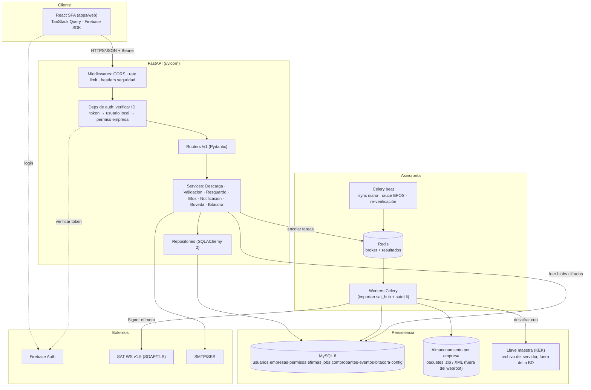
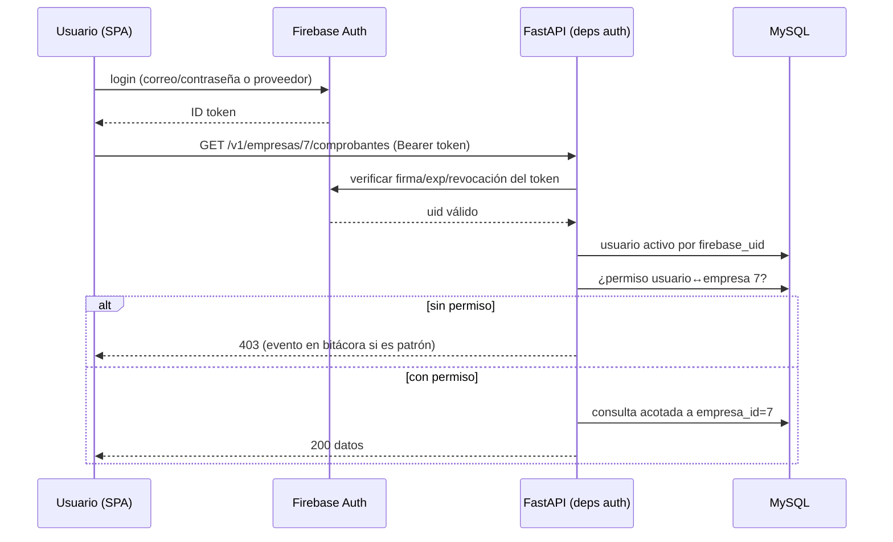
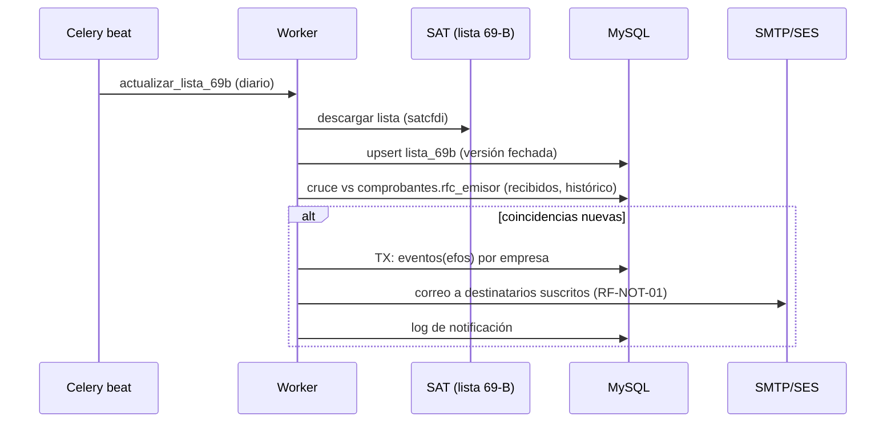
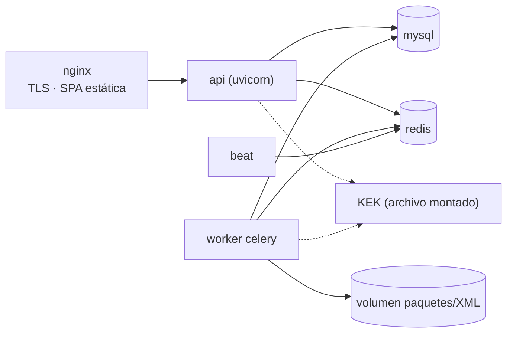

# 02 — Arquitectura del Sistema

| Campo | Valor |
|---|---|
| Documento | 02 — Arquitectura del Sistema |
| Versión | 2.0 |
| Fecha | 2026-07-27 |
| Depende de | [`ADR-003`](ADR/ADR-003_pivote_web.md) · [`01_SRS`](../01-vision/01_SRS_especificacion_requisitos.md) |
| Reemplaza | Arquitectura v1.0 (escritorio, archivada) |

> ⚠️ Cambio de stack respecto a v1.0: de app de escritorio a plataforma web (ADR-003). El núcleo `sat_hub` se conserva como paquete de dominio de los workers.

---

## 1. Principios rectores

**1. Seguridad antes que funcionalidad.** La cadena token→permiso-empresa→servicio y la bóveda se construyen antes que cualquier módulo de negocio (prioridad 1 de David). Ningún endpoint entra al repositorio sin su dependencia de autorización. *Por qué:* custodiar e.firmas ajenas no admite "lo aseguramos después".

**2. El request nunca espera al SAT.** La API responde en milisegundos; todo lo que toca al SAT (solicitar, verificar, descargar, status, 69-B) vive en workers Celery. *Por qué:* el WS tarda de segundos a días; acoplar HTTP al SAT rompería la plataforma.

**3. El estado del job vive en MySQL, no en el proceso.** La máquina de estados v1.0 se conserva con sus invariantes; cada transición se persiste antes de continuar. *Por qué:* deploys y reinicios de worker son rutina; el trabajo ante el SAT no se pierde ni se duplica.

**4. Aislamiento por empresa como control central.** Toda tabla de datos cuelga de `empresa_id`; todo servicio recibe la empresa ya autorizada por la capa de auth. *Por qué:* es el modelo multicliente — el equivalente funcional del aislamiento por cliente de v1.0.

**5. Reglas normativas como datos.** Límites del SAT y parámetros operativos en configuración versionada y auditada. *Por qué:* cambian por ejercicio fiscal.

## 2. Estilo arquitectónico

**Monolito modular Python con workers**, servido como SPA + API REST. No hay microservicios: API y workers comparten el mismo código de dominio (paquete `app` + `sat_hub`) y la misma BD, desplegados como procesos distintos (uvicorn, celery worker, celery beat). La justificación es económica y operativa: un equipo pequeño, una instancia, un despliegue; la separación API/worker da la asincronía necesaria sin el costo de servicios distribuidos. La frontera dura es contra el frontend (contrato del doc 05) y contra el SAT (fachada `satcfdi`).

### 2.1 Diagrama de capas



## 3. Descripción de capas

### 3.1 Cliente (React SPA)
Pantallas del doc 09; consume exclusivamente `lib/api.ts` (contrato doc 05). Maneja el ID token de Firebase en memoria (no en localStorage). **No debe:** decidir permisos, calcular nada fiscal, ni conocer rutas de archivos del servidor.

### 3.2 Middlewares y dependencias de auth
CORS restrictivo al origen de la SPA; rate limiting por usuario/IP en grupos de endpoints; headers de seguridad. La dependencia `require_empresa(rol_minimo)` verifica ID token contra Firebase, resuelve el usuario local (activo), y valida el permiso sobre la `empresa_id` de la ruta. **No debe:** existir endpoint de datos sin esta dependencia.

### 3.3 Routers
Delgados: validan payloads (Pydantic), invocan un service, mapean errores a HTTP. **No deben:** contener SQL ni reglas de negocio.

### 3.4 Services (dominio)
`DescargaService` (troceo + creación de jobs + encolado), `ValidacionService`, `ResguardoService`, `EfosService`, `NotificacionService`, `BovedaService`, `BitacoraService`, `ConfigService`. Aquí viven las reglas; reciben la empresa ya autorizada. **No deben:** leer el token ni tocar Redis directamente (usan el encolador).

### 3.5 Repositories
SQLAlchemy 2 tipado; transacciones explícitas para escrituras multi-tabla; consultas de listado con joins (cero N+1). **No deben:** exponer la sesión cruda a routers.

### 3.6 Workers (Celery) — el "Engine" de v1.0
Tareas: `ejecutar_job` (máquina de estados completa con persistencia por transición), `validar_estatus_lote`, `resguardar_job`, `cruzar_efos`, `sync_diaria_empresa`, `enviar_notificacion`, `exportar_excel`. Importan `sat_hub` (troceo, fachada satcfdi, errores) y son los únicos procesos que hablan con el SAT y descifran la bóveda. Reintentos con backoff de Celery alineados a RF-DESC-05.

### 3.7 Scheduler (Celery beat)
Corridas programadas: sync diaria por empresa activa (hora configurable), actualización + cruce de lista 69-B, re-verificación de estatus (base de cancelaciones tardías), recuperación de corridas perdidas al arrancar.

### 3.8 Bóveda (BovedaService)
Envelope encryption: DEK aleatoria por e.firma (AES-256-GCM) cifra `.key` y contraseña; la KEK maestra (archivo del servidor con permisos 600, fuera de la BD y de los backups de BD) envuelve las DEK. Descifrado solo en workers; cada uso en bitácora. Rotación de KEK documentada en doc 04.

### 3.9 Eventos y auditoría
`BitacoraService` transversal (INSERT-only, misma transacción). Los eventos de riesgo (cancelación tardía, EFOS) se materializan en tabla `eventos` y disparan `NotificacionService`.

## 4. Flujos de datos críticos

### 4.1 Autenticación y acceso a una empresa



### 4.2 Alta de e.firma en la bóveda

```mermaid
sequenceDiagram
    participant Op as Operador
    participant API as FastAPI
    participant BV as BovedaService
    participant DB as MySQL
    Op->>API: POST /v1/empresas/7/efirma (.cer+.key+password, TLS)
    API->>BV: validar y guardar
    BV->>BV: Signer.load() — ¿abre? ¿RFC coincide? ¿vigente?
    BV->>BV: DEK aleatoria; AES-256-GCM(.key, password); KEK envuelve DEK
    BV->>DB: TX: blobs cifrados + metadatos + bitacora(alta_efirma)
    DB-->>API: ok
    API-->>Op: 201 (metadatos: serie, vigencia — NUNCA material de llave)
```

### 4.3 Descarga masiva vía workers

```mermaid
sequenceDiagram
    participant Op as Operador
    participant API as FastAPI
    participant R as Redis
    participant W as Worker Celery
    participant BV as Bóveda
    participant SAT as SAT WS
    participant DB as MySQL
    Op->>API: POST /v1/empresas/7/descargas {tipo, rango}
    API->>DB: trocear rango → jobs NUEVO (+bitácora del disparo)
    API->>R: encolar ejecutar_job(job_id...)
    API-->>Op: 202 {job_ids}
    R->>W: ejecutar_job(42)
    W->>BV: descifrar e.firma (bitácora de uso)
    W->>W: validar vigencia; Signer en memoria
    W->>SAT: solicitud → IdSolicitud
    W->>DB: estado=SOLICITADO
    loop polling con backoff
        W->>SAT: verificar(IdSolicitud)
        W->>DB: EN_PROCESO / TERMINADA
    end
    W->>SAT: descargar paquetes
    W->>W: escribir .zip (almacén empresa 7)
    W->>DB: TX: estado=DESCARGADO
    Note over W: encadena resguardar_job → comprobantes
```

### 4.4 Cruce EFOS y notificación



## 5. Patrones de implementación

**Dependencia de autorización (regla 3 de CLAUDE.md):**

```python
# app/api/deps.py
async def require_empresa(rol_minimo: Rol = Rol.CONSULTA):
    async def dep(empresa_id: int, authorization: str = Header(...),
                  db: AsyncSession = Depends(get_db)) -> ContextoEmpresa:
        uid = await verificar_id_token(authorization.removeprefix("Bearer "))
        usuario = await usuarios_repo.activo_por_uid(db, uid)     # 403 si no existe/inactivo
        permiso = await permisos_repo.get(db, usuario.id, empresa_id)
        if permiso is None or permiso.rol < rol_minimo:
            raise HTTPException(403)                              # IDOR bloqueado en la puerta
        return ContextoEmpresa(usuario=usuario, empresa_id=empresa_id, rol=permiso.rol)
    return dep
```

**Router delgado → service → repos:**

```python
# app/api/v1/descargas.py
@router.post("/empresas/{empresa_id}/descargas", status_code=202)
async def crear_descarga(payload: CrearDescargaIn,
                         ctx: ContextoEmpresa = Depends(require_empresa(Rol.OPERADOR)),
                         db: AsyncSession = Depends(get_db)) -> CrearDescargaOut:
    jobs = await descarga_service.crear(db, ctx, payload)   # trocea, persiste, bitácora, encola
    return CrearDescargaOut(job_ids=[j.id for j in jobs])
```

**Transición persistida en el worker (invariante 4 del SRS §4):**

```python
# app/worker/tasks.py
@celery.task(bind=True, autoretry_for=(SatReintentableError,),
             retry_backoff=True, retry_kwargs={"max_retries": None})  # máx. real en config
def ejecutar_job(self, job_id: int) -> None:
    with session() as db:
        job = jobs_repo.get(db, job_id)
        if job.estado is Estado.NUEVO:
            signer = boveda.signer_para(db, job.empresa_id, uso=f"job:{job_id}")  # bitácora
            fiel.validar_vigencia(signer)                      # vencida ⇒ ERROR, no encola
            job.id_solicitud = sat_facade.solicitar(signer, job)
            jobs_repo.transicion(db, job, Estado.SOLICITADO)   # persistir ANTES de seguir
        ...
```

**Escritura multi-tabla con bitácora en la misma transacción:**

```python
# app/services/resguardo.py
async def indexar(db: AsyncSession, job: Job, comps: list[ComprobanteIn]) -> int:
    async with db.begin():
        n = await comprobantes_repo.upsert_lote(db, job.empresa_id, job.id, comps)
        await jobs_repo.transicion(db, job, Estado.DESCARGADO)
        await bitacora_repo.insert(db, actor="worker", accion="resguardo",
                                   entidad=f"job:{job.id}", detalle={"comprobantes": n})
    return n
```

## 6. Estrategia de despliegue

- **Infraestructura:** un servidor (VPS/cloud — D7 pendiente) con Docker Compose: `nginx` (TLS, estáticos de `apps/web`), `api` (uvicorn), `worker`, `beat`, `mysql`, `redis`. Almacenamiento de paquetes en volumen dedicado por empresa, fuera del webroot.
- **Separación de secretos:** KEK en archivo montado solo en `api`/`worker` (no en imagen); credenciales por variables de entorno del host; backups de BD **no** incluyen la KEK.



**Checklist de hardening de producción:** TLS con renovación automática; firewall solo 443/22; MySQL y Redis sin exposición pública; contenedores non-root; backups cifrados probados (restore ensayado); `pip install --require-hashes`; `pip-audit`/`npm audit` en CI; logs sin secretos (filtro de redacción); monitoreo de workers y de la corrida diaria.

## 7. Decisiones de diseño pendientes / riesgos técnicos

| Decisión / riesgo | Opciones | Estado |
|---|---|---|
| D7 — Infraestructura de despliegue | VPS propio vs cloud gestionado | Pendiente (David); no bloquea Fase 0/1 |
| KEK: archivo vs KMS | Archivo (simple) → KMS (endurecimiento) | Archivo en MVP; migración documentada doc 04 |
| Firma exacta de satcfdi para *emitidos* | Verificación contra v26.x instalada | Sprint de cimientos (heredado H-04 v1.0) |
| Límite de solicitudes SAT concurrentes por RFC | Backoff como estado esperado | Igual que v1.0 (RF-DESC-05) |
| Estrategia de export pesado | Síncrono vs worker con descarga diferida | Worker si > umbral (RF-LIST-02) |
| D1/D2 nomenclatura y comprobante | Configurables | Pendientes de Pedro; no bloquean |
