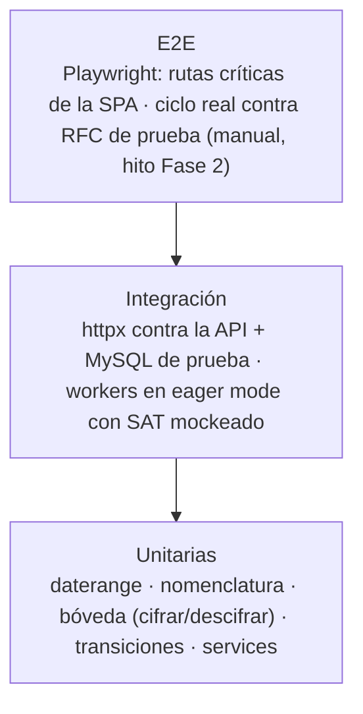

# 06 — Plan de Pruebas

| Campo | Valor |
|---|---|
| Documento | 06 — Plan de Pruebas |
| Versión | 2.0 |
| Fecha | 2026-07-27 |
| Frameworks | `pytest` + `pytest-asyncio` + `httpx` (API) · Celery eager mode (workers) · `mypy` · `pip-audit` · Vitest + Testing Library (SPA) · Playwright (E2E rutas) |
| Cobertura objetivo | ≥ 85% backend; 100% transiciones de la máquina de estados; 100% endpoints con caso negativo de permiso |
| Depende de | [`01_SRS`](../01-vision/01_SRS_especificacion_requisitos.md) · [`04_plan_de_seguridad`](../04-seguridad/04_plan_de_seguridad.md) · [`05_especificacion_api`](../05-api/05_especificacion_api.md) |

---

## 1. Estrategia

| Tipo | Herramienta | Qué cubre |
|---|---|---|
| Unitaria backend | pytest | Lógica pura: troceo, nomenclatura, envelope encryption, validación de vigencia, transiciones legales |
| Integración API | httpx + MySQL efímero (testcontainers) | Endpoints completos con auth simulada y permisos reales en BD |
| Integración workers | Celery eager + fachada SAT mockeada | Máquina de estados completa, reanudación, reintentos, resguardo |
| Frontend | Vitest + Testing Library | Componentes y hooks contra `ApiClient` mock |
| E2E | Playwright | Login → empresa → descarga → monitoreo → listado → export |
| Estático | mypy · eslint/tsc | Contratos tipados (doc 05) |
| Dependencias | pip-audit · npm audit | A06 |

### 1.2 Entornos y datos de prueba
MySQL efímero por corrida (testcontainers) migrado con Alembic — verifica que el esquema real coincide con el DDL del doc 03 (Gobernanza v3 mejora 5 adaptada). Firebase simulado: la dependencia de verificación se sustituye por un verificador de prueba que emite uids controlados (los flujos de permisos usan la BD real). SAT siempre mockeado salvo el hito manual contra RFC de prueba del SAT (`EKU9003173C9`); KEK de prueba generada por corrida. Fixtures con dominios `@demo.test`, UUID ficticios; jamás credenciales o CFDI reales.

---

## 2. Pruebas por módulo

### 2.1 Autenticación y permisos (RF-AUTH — prioridad 1)

| Caso | Esperado |
|---|---|
| Petición sin token / token expirado / firma inválida | 401 |
| Token válido, uid sin usuario local | 403 |
| Token válido, usuario `activo=0` | 403 (RF-AUTH-04) |
| Usuario con permiso `consulta` llama endpoint mutante | 403 |
| Admin gestiona usuarios/permisos | 200/201 + bitácora |
| No-admin llama endpoints de admin | 403 |

### 2.2 IDOR / aislamiento por empresa (A01 — obligatoria por recurso)

Para **cada** recurso de datos (efirma, descargas, jobs, comprobantes, eventos, notificaciones, export):

| Caso | Esperado |
|---|---|
| Usuario con permiso sobre empresa 7 pide recurso de empresa 8 | 403/404 idéntico a inexistente (anti-enumeración) |
| `job_id` real de otra empresa vía ruta de la propia | 404 (repo filtra por empresa, doc 04 A01) |
| Enumeración secuencial de ids ajenos | Sin fuga de existencia; 403 repetidos quedan en log |

### 2.3 Bóveda (RF-BOV — prioridad 1)

| Caso | Esperado |
|---|---|
| Alta con e.firma válida | 201 con metadatos; BD solo contiene blobs cifrados; bitácora `alta_efirma` |
| Contraseña incorrecta / .key corrupta | 422 `EFIRMA_NO_ABRE`; nada persistido |
| RFC del certificado ≠ RFC de la empresa | 422 `RFC_NO_COINCIDE` |
| e.firma vencida en alta | 422 `EFIRMA_VENCIDA` |
| Cifrar→descifrar roundtrip (unitaria) | Idéntico al original; tag GCM alterado ⇒ excepción |
| Dump de BD sin KEK | Blobs indescifrables (prueba unitaria de diseño) |
| Uso por worker | Evento `uso_boveda` en bitácora por cada descifrado |
| Respuestas de API y logs tras alta/uso | Ninguna contiene contraseña ni material de llave (grep automatizado) |
| Eliminación | Blobs borrados; jobs/comprobantes históricos intactos |

### 2.4 Máquina de estados del job (exhaustiva — heredada v1.0)

**Válidas** (deben aceptarse y persistirse, con timestamps):

| # | Origen → Destino | Evento |
|---|---|---|
| T1 | NUEVO → SOLICITADO | IdSolicitud recibido |
| T2 | NUEVO → ERROR | e.firma vencida/inválida |
| T3 | SOLICITADO → EN_PROCESO | SAT "en proceso" |
| T4 | SOLICITADO → TERMINADA | SAT "terminada" |
| T5 | SOLICITADO → ERROR | rechazo definitivo |
| T6 | EN_PROCESO → EN_PROCESO | polling (intentos++) |
| T7 | EN_PROCESO → TERMINADA | paquetes listos |
| T8 | EN_PROCESO → ERROR | reintentos agotados |
| T9 | TERMINADA → DESCARGADO | paquetes escritos (conteo == `paquetes`) |
| T10 | TERMINADA → ERROR | fallo de descarga |
| T11 | ERROR → NUEVO | reintento manual con permiso (bitácora) |

**Inválidas** (⇒ `TransicionIlegalError` / 409):

| # | Transición ilegal | Razón |
|---|---|---|
| I1 | NUEVO → DESCARGADO | No salta solicitud/verificación |
| I2 | NUEVO → TERMINADA | Ídem |
| I3 | SOLICITADO → DESCARGADO | Falta descarga |
| I4 | DESCARGADO → cualquiera | Terminal de éxito |
| I5 | EN_PROCESO → NUEVO | No se retrocede salvo desde ERROR |
| I6 | SOLICITADO → NUEVO | `id_solicitud` inmutable |
| I7 | ERROR → SOLICITADO | El reintento pasa por NUEVO |
| I8 | Reintentar job no-ERROR vía API | 409 |

### 2.5 Workers: integración con SAT mockeado (RF-DESC)

| Escenario | Esperado |
|---|---|
| Camino feliz completo | DESCARGADO; paquetes en almacenamiento de la empresa; resguardo encadenado |
| "En proceso" ×3 → "terminada" | 3 iteraciones EN_PROCESO, luego T7→T9 |
| Intermitencia transitoria | Retry con backoff; se recupera sin ERROR |
| Fallo persistente > máx. reintentos | ERROR con mensaje |
| **Reanudación:** matar worker en EN_PROCESO y reprocesar | Mismo `id_solicitud`; sin solicitud duplicada |
| Emitido vs recibido | Método satcfdi correcto por tipo |
| Rango de 3 años | ≥3 jobs contiguos sin traslape (RF-DESC-01) |
| Empresa con e.firma vencida en sync | Job a ERROR/omitido + evento `efirma_por_vencer`/aviso |

### 2.6 Sincronización, vigilancia y notificaciones (prioridad 3)

| Escenario | Esperado |
|---|---|
| Corrida beat de sync diaria | Jobs `origen=sync` por empresa activa con e.firma vigente; resumen en eventos |
| Corrida perdida (beat caído a la hora programada) | Recuperación al arrancar (RNF-05) |
| CFDI de mes previo pasa vigente→cancelado | Evento `cancelacion_tardia` una sola vez (idempotencia por hash) |
| Actualización lista 69-B con RFC que tiene facturas recibidas | Evento `efos` con UUIDs afectados + correo a suscritos |
| Mismo cruce re-ejecutado | Sin evento duplicado (UNIQUE hash_detalle) |
| Destino suscrito solo a `efos` | No recibe correos de otros eventos |
| Fallo SMTP | `notificacion_log.resultado=fallido`; reintento |

### 2.7 Casos negativos de seguridad (doc 04)

| Control | Caso | Esperado |
|---|---|---|
| A02 | grep de contraseñas/llaves en BD, logs, Redis tras suite completa | Cero coincidencias |
| A03 | Filtros con `' OR 1=1 --`, `; DROP TABLE`, `../` en plantilla de nomenclatura | Tratado como literal / rechazado; nombre de archivo saneado |
| A05 | `bitacora` UPDATE/DELETE con el usuario MySQL de la app | Privilegio denegado |
| A07 | Token de usuario recién desactivado | 403 inmediato |
| A08 | `paquetes` reportados ≠ archivos escritos | No pasa a DESCARGADO |
| A09 | Log con "password=…" inyectado | Redactado por el filtro |
| Export | URL firmada de export de otra empresa | 403/404 |

### 2.8 Frontend (SPA)

Componentes con estados default/loading/empty/error contra `ApiClient` mock; guardas de ruta (sin sesión → login; sin permiso → pantalla vacía segura); tabla de comprobantes con filtros y paginación; formulario de e.firma no retiene contraseña en estado tras enviar.

---

## 3. Pruebas de rendimiento

| Escenario | Umbral |
|---|---|
| Listado de comprobantes con 1M filas/empresa (filtros indexados) | < 500 ms p95 (RNF-03) |
| API bajo corrida de sync (workers saturados) | Endpoints de lectura sin degradación (asincronía RNF-04) |
| Cruce EFOS: lista ~15k RFC × 1M comprobantes | Completa en la ventana nocturna |
| Export 100k filas | En worker, sin OOM (streaming) |

---

## 4. Matriz de trazabilidad

| Requisito | Casos |
|---|---|
| RF-AUTH-01…04 | §2.1 |
| RF-BOV-01…04 | §2.3 |
| RF-BIT-01 | §2.1/§2.3 (bitácora presente) + §2.7 A05 |
| RF-EMP-01…03 | §2.2 + integración de empresas |
| RF-DESC-01…06 | §2.4 + §2.5 |
| RF-VAL-01…03 | §2.5 + §2.6 (re-verificación) |
| RF-RES-01…03 | §2.5 (resguardo encadenado) + unitarias de nomenclatura |
| RF-SYNC-01…03 | §2.6 |
| RF-RIES-01/02 | §2.6 |
| RF-NOT-01 | §2.6 |
| RF-LIST-01/02 | integración listados + §3 |
| RF-CFG-01 | unitaria: cambio de config altera troceo sin deploy |
| Máquina de estados | §2.4 — 100% |
| A01…A09 | §2.2 + §2.7 |

---

## 5. Criterios de aceptación de calidad (gate de Fase 2)

- [ ] `pytest` verde; cobertura ≥ 85%; máquina de estados 100% (T1–T11 + I1–I8).
- [ ] 100% de endpoints de datos con caso negativo de permiso verde (§2.2).
- [ ] `mypy` y `tsc` sin errores; `pip-audit`/`npm audit` sin críticas.
- [ ] grep de secretos (§2.7 A02) limpio en BD/logs/Redis.
- [ ] Esquema migrado == DDL doc 03 (verificación Alembic vs documento).
- [ ] `ApiClient` congelado == endpoints implementados (Gobernanza v3 mejora 4).
- [ ] **Hito manual:** ciclo completo contra RFC de prueba del SAT vía workers, con reanudación y sync nocturna corriendo ≥ 1 semana.
