# 07 — Roadmap por Fases y Sprints

| Campo | Valor |
|---|---|
| Documento | 07 — Roadmap |
| Versión | 2.0 |
| Fecha | 2026-07-27 |
| Cadencia | Sprints de 2 semanas |
| Depende de | [`01_SRS`](../01-vision/01_SRS_especificacion_requisitos.md) · [`06_plan_de_pruebas`](../06-pruebas/06_plan_de_pruebas.md) · [`inventario_funcional.md`](../00-fuentes/inventario_funcional.md) |

---

## 1. Principio de orden seguro

El roadmap materializa las prioridades de David: **la seguridad se construye antes que el negocio** (Sprint 1 completo dedicado a auth + bóveda + bitácora, sin una sola función fiscal), el **núcleo heredado de escritorio** va inmediatamente después, los **complementos de MVP** encima, y **nada del backlog futuro (R2/R3) se toca** hasta cerrar el MVP. Entre Fase 0 y el backend está la Fase 1 (demo): el prototipo se valida con stakeholder y el contrato de API se congela antes de escribir backend (Demo-First v2.1 + gate de Gobernanza v3).

```mermaid
flowchart LR
    F0["Fase 0<br/>Docs 00–08"] --> F1["Fase 1<br/>doc 09 + prototipo externo<br/>validación + freeze del contrato"]
    F1 --> S0["Sprint 0<br/>Cimientos"]
    S0 --> S1["Sprint 1<br/>SEGURIDAD: auth+RBAC+bóveda+bitácora"]
    S1 --> S2["Sprint 2<br/>Núcleo: empresas+descarga masiva"]
    S2 --> S3["Sprint 3<br/>Núcleo: validación+resguardo+listados"]
    S3 --> S4["Sprint 4<br/>Complementos: sync+EFOS+alertas+correo"]
    S4 --> S5["Sprint 5<br/>Endurecimiento + DoD Fase 2"]
    S5 --> MVP["Lanzamiento MVP"]
    MVP -.-> R2["R2 fiscal determinista"] -.-> R3["R3 motor fiscal"]
```

---

## 2. Fase 1 — Demo (antes de cualquier backend)

**Objetivo:** validar UX y congelar contratos sin escribir código de producción.
Entregables: `demo-ux/09_demo_ux_guia.md` (ya en este paquete) → prototipo en herramienta externa (Claude Design) → sesión de validación con stakeholder (David/Pedro) → bitácora hallazgos→cambios → re-sincronizar SRS (01) y API (05) → **congelar `ApiClient`**.
**Hito (gate):** contrato congelado y Fase 1 con DoD verificada en README/CLAUDE. Bloquea el Sprint 0.

## 3. Fase 2 — Backend + apps/web (MVP)

### Sprint 0 — Cimientos
**Objetivo:** esqueleto reproducible con calidad de gate desde el día uno.
- Monorepo (`app/` FastAPI + `apps/web`), Docker Compose (nginx, api, worker, beat, mysql, redis), CI (pytest, mypy, tsc, audits).
- Migraciones Alembic = DDL doc 03; verificación esquema↔documento automatizada.
- Portar `sat_hub` v1.0 como paquete (daterange, fachada satcfdi, errores); **confirmar firma satcfdi para emitidos** (riesgo heredado).
- Config versionada (RF-CFG-01); logging con filtro de redacción.
- **Hito:** `docker compose up` levanta todo; CI verde; esquema migrado.

### Sprint 1 — Seguridad y autenticación (prioridad 1 — sin funciones de negocio)
**Objetivo:** nadie entra sin permiso; la bóveda opera cifrada y auditada.
- Verificación de ID token + usuario local + `require_empresa` (doc 04 §3.2); gestión de usuarios y permisos (RF-AUTH-01…04).
- Bóveda completa: envelope encryption, alta/validación/reemplazo/borrado de e.firma, KEK operativa (RF-BOV-01…04).
- Bitácora transaccional (RF-BIT-01) + privilegios MySQL restrictivos.
- Pruebas: doc 06 §2.1, §2.2 (IDOR por recurso existente), §2.3, §2.7 (A02/A05/A07).
- **Hito:** suite de seguridad verde; grep de secretos limpio; demo interna de alta de e.firma con bitácora.

### Sprint 2 — Núcleo de escritorio I: empresas y descarga masiva (prioridad 2)
**Objetivo:** el ciclo asíncrono v1.0 corriendo en workers.
- Empresas (RF-EMP-01…03); tareas Celery `ejecutar_job` con máquina de estados persistida (RF-DESC-01…06); monitoreo básico (RF-SYNC-03); reintento manual.
- Pruebas: doc 06 §2.4 completa (T1–T11, I1–I8), §2.5.
- **Hito:** ciclo `solicitar→verificar→descargar` contra RFC de prueba del SAT vía workers, con reanudación demostrada.

### Sprint 3 — Núcleo de escritorio II: validación, resguardo y consulta (prioridad 2)
**Objetivo:** de paquetes a índice consultable.
- Resguardo: parseo → `comprobantes`, nomenclatura configurable, comprobante según D1/D2 (RF-RES-01…03).
- Validación de estatus en lote y re-verificación (RF-VAL-01…03).
- Listados con filtros + export a Excel en worker (RF-LIST-01/02).
- Pruebas: resguardo encadenado, listados sin N+1, rendimiento §3 sobre datos sintéticos.
- **Hito:** una descarga real termina indexada, validada, consultable y exportable.
- **Gate de decisiones:** D1/D2 (Pedro) deben cerrarse en este sprint para fijar defaults; si no, quedan configurables con default provisional documentado.

### Sprint 4 — Complementos del MVP (prioridad 3)
**Objetivo:** la plataforma trabaja sola y avisa.
- Sync diaria por empresa con beat + recuperación de corridas perdidas (RF-SYNC-01); descarga manual UI (RF-SYNC-02).
- Lista 69-B: descarga, versión, cruce histórico + eventos EFOS (RF-RIES-02); cancelaciones tardías por re-verificación programada (RF-RIES-01).
- Notificaciones por correo con destinos/suscripciones y log (RF-NOT-01).
- Pruebas: doc 06 §2.6 completa (idempotencia incluida).
- **Hito:** una semana de corridas nocturnas sin intervención; alerta EFOS y cancelación tardía demostradas end-to-end.

### Sprint 5 — Endurecimiento y cierre de Fase 2
**Objetivo:** DoD verificada, no declarada (Gobernanza v3 mejora 3).
- Checklist de hardening (doc 04 §4.2) sobre el entorno real; re-verificación OWASP contra código final; pruebas de rendimiento con volumen realista (RNF-03/08).
- Verificaciones de contrato: `ApiClient` congelado == endpoints; esquema == DDL doc 03.
- Backups cifrados + restore ensayado; runbook de incidentes (doc 04 §4.3); documentación de operación.
- **Hito (lanzamiento MVP):** criterios del SRS §7 completos y checklist de cierre de Fase 2 verificado ítem por ítem.

---

## 4. Riesgos y mitigaciones

| Riesgo | Prob. | Impacto | Mitigación | Sprint |
|---|---|---|---|---|
| Compromiso de la bóveda / KEK mal gestionada | Baja | Crítico | Diseño doc 04 §A02; hardening S5; runbook de revocación | 1, 5 |
| Firma satcfdi para emitidos difiere | Media | Medio | Verificación temprana y congelación en doc 05 | 0 |
| Saturación del SAT alarga jobs a días | Alta | Medio | Diseño asíncrono reanudable ya lo absorbe | 2 |
| D1/D2 no se cierran a tiempo | Media | Bajo | Configurables con default provisional | 3 |
| Cruce EFOS lento sobre histórico grande | Media | Medio | Índices doc 03; cruce incremental por versión de lista | 4 |
| Fatiga de alertas (correo excesivo) | Media | Medio | Idempotencia por hash + suscripción granular | 4 |
| Costo/operación del servidor (D7 sin decidir) | Media | Bajo | Compose portable: VPS o cloud sin cambio de diseño | 0, 5 |

## 5. Backlog post-MVP (prioridad 4 — SRS §8)

**R2 — fiscal determinista:** conciliación REP, reportes de nómina (con restricción por usuario), DIOT, CSF (+ spike Opinión de Cumplimiento H-04), dashboards estadísticos, export PDF/ZIP masivo, permisos más finos.
**R3 — motor fiscal:** IVA 4.0 y ISR a flujo (requiere D5: Pedro como validador fiscal con casos reales), conciliación del precargado (requiere D6), validación completa de guías de llenado, comercialización (requiere D4 + ADR).
**Excluidos salvo demanda:** CONTPAQi ADD, API pública, SSO, app móvil.
