# 07 — Roadmap por Fases y Sprints

| Campo | Valor |
|---|---|
| Documento | 07 — Roadmap |
| Versión | 2.0 |
| Fecha | 2026-07-27 |
| Cadencia | Sprints de 2 semanas |
| Depende de | [`01_SRS`](../01-vision/01_SRS_especificacion_requisitos.md) · [`06_plan_de_pruebas`](../06-pruebas/06_plan_de_pruebas.md) · [`inventario_funcional.md`](../00-fuentes/inventario_funcional.md) |

---

## 1. Principio de orden seguro

El roadmap materializa las prioridades de David: **la seguridad se construye antes que el negocio** (Sprint 1 completo dedicado a auth + bóveda + bitácora, sin una sola función fiscal), el **núcleo heredado de escritorio** va inmediatamente después, los **complementos de MVP** encima, y **nada del backlog futuro (R2/R3) se toca** hasta cerrar el MVP. Entre Fase 0 y el backend está la Fase 1 (demo): el prototipo se valida con stakeholder y el contrato de API se congela antes de escribir backend (Demo-First v2.1 + gate de Gobernanza v3).

```mermaid
flowchart LR
    F0["Fase 0<br/>Docs 00–08"] --> F1["Fase 1<br/>doc 09 + prototipo externo<br/>validación + freeze del contrato"]
    F1 --> S0["Sprint 0<br/>Cimientos"]
    S0 --> S1["Sprint 1<br/>SEGURIDAD: auth+RBAC+bóveda+bitácora"]
    S1 --> S2["Sprint 2<br/>Núcleo: empresas+descarga masiva"]
    S2 --> S3["Sprint 3<br/>Núcleo: validación+resguardo+listados"]
    S3 --> S4["Sprint 4<br/>Complementos: sync+EFOS+alertas+correo"]
    S4 --> S5["Sprint 5<br/>Endurecimiento + DoD Fase 2"]
    S5 --> MVP["Lanzamiento MVP"]
    MVP -.-> R2["R2 fiscal determinista"] -.-> R3["R3 motor fiscal"]
```

---

## 2. Fase 1 — Demo (antes de cualquier backend)

**Objetivo:** validar UX y congelar contratos sin escribir código de producción.
Entregables: `demo-ux/09_demo_ux_guia.md` (ya en este paquete) → prototipo en herramienta externa (Claude Design) → sesión de validación con stakeholder (David/Pedro) → bitácora hallazgos→cambios → re-sincronizar SRS (01) y API (05) → **congelar `ApiClient`**.
**Hito (gate):** contrato congelado y Fase 1 con DoD verificada en README/CLAUDE. Bloquea el Sprint 0.

## 3. Fase 2 — Backend + apps/web (MVP)

### Sprint 0 — Cimientos ✅ Cerrado (2026-07-27)
**Objetivo:** esqueleto reproducible con calidad de gate desde el día uno.
- Monorepo (`app/` FastAPI + `apps/web`), Docker Compose (api, worker, beat, mysql, redis — `nginx` diferido a despliegue), CI (pytest, mypy, pip-audit; tsc/lint de `apps/web` ya vivían aparte).
- Migraciones Alembic = DDL doc 03; verificado tabla por tabla contra el documento (12/12 tablas, ENUMs en minúsculas, `ON UPDATE CURRENT_TIMESTAMP`, `utf8mb4_unicode_ci`).
- Portado `sat_hub` v1.0 como paquete (`app/sat_hub/`: domain, daterange, errores, fachada satcfdi) — `store.py`/`engine.py`/`secrets.py` quedan para Sprint 2 (se reescriben contra MySQL/Celery/bóveda). **Firma satcfdi confirmada**: `satcfdi==26.7.4` (`app/scripts/inspect_satcfdi.py`) coincide con el contrato congelado.
- **Hito verificado:** `docker compose up` levanta los 5 servicios limpio; CI (`.github/workflows/ci.yml`) corre pytest+mypy+pip-audit; esquema migrado y comparado contra doc 03.

### Sprint 1 — Seguridad y autenticación (prioridad 1 — sin funciones de negocio) ✅ Cerrado (2026-07-27)
**Objetivo:** nadie entra sin permiso; la bóveda opera cifrada y auditada.
- Verificación de ID token (Firebase Admin SDK) + usuario local + `require_empresa` (`app/api/deps.py`); alta de usuarios (crea la cuenta de Firebase vía Admin SDK) y permisos (RF-AUTH-01…04).
- Bóveda completa (`app/services/boveda.py` + `app/services/fiel.py`): envelope encryption AES-256-GCM, alta/validación (abre/RFC/vigencia)/reemplazo/borrado de e.firma, KEK de desarrollo (`app/scripts/generar_kek_dev.py`; KEK de producción sigue siendo el procedimiento manual de doc 04 §3.5) (RF-BOV-01…04).
- Bitácora transaccional (`app/services/bitacora.py`, RF-BIT-01), verificada con un usuario MySQL real restringido a INSERT+SELECT en las pruebas.
- Pruebas: 17 casos verdes cubriendo doc 06 §2.1 (auth), §2.2 (IDOR — 404 idéntico para empresa inexistente/ajena), §2.3 (bóveda: los 3 códigos 422, cifrado en reposo verificado, bitácora), §2.7 (A02 grep de secretos, A05 grants de `bitacora`). MySQL efímero vía testcontainers; verificador de Firebase falso (sin red real); certificados de prueba autofirmados (nunca material real).
- **Hito verificado:** suite de seguridad verde (`pytest`, 17/17); `mypy --strict` limpio (52 archivos); alta real de e.firma de prueba cifra en reposo y queda en bitácora.
- **Pendiente para poder operar con datos reales:** David debe generar una service account de Firebase (Admin SDK) — las credenciales web de `apps/web` no sirven para verificar tokens en el servidor.

### Sprint 2 — Núcleo de escritorio I: empresas y descarga masiva (prioridad 2) ✅ Código cerrado (2026-07-28)
**Objetivo:** el ciclo asíncrono v1.0 corriendo en workers.
- Empresas (RF-EMP-01…03) — ya cerrado en la sesión de Sprint 0-1 (alta/baja lógica/borrado real).
- Tarea Celery `ejecutar_job` con máquina de estados persistida (`app/repositories/jobs.py`, `app/worker/tasks.py`) — RF-DESC-01…06.
- Monitoreo básico (`GET /jobs` con filtros) — RF-SYNC-03; reintento manual (`POST /jobs/{id}/reintentar`, T11).
- `apps/web` conectado de verdad: `crearDescarga`/`listarJobs`/`reintentarJob` vía `api.http.ts` (antes resueltos por el mock).
- Pruebas: doc 06 §2.4 completa (T1–T11, I1–I8) en `tests/test_maquina_estados.py`; §2.5 (camino feliz, reintentos, rechazo, e.firma vencida, reanudación) en `tests/test_worker.py` con `SatFacade` mockeada — nunca toca el SAT real ni usa la e.firma de producción.
- **Hito pendiente (manual, requiere autorización explícita):** el ciclo `solicitar→verificar→descargar` contra el SAT real (con RFC de prueba del SAT o la e.firma real de producción) no se ha ejecutado — solo se validó contra una fachada simulada. Un intento real consume cupo real del SAT y registra una solicitud real; queda como paso explícito que David debe autorizar por separado.

### Sprint 3 — Núcleo de escritorio II: validación, resguardo y consulta (prioridad 2) ✅ Cerrado (2026-07-28)
**Objetivo:** de paquetes a índice consultable.
- Resguardo: parseo → `comprobantes` (`app/services/resguardo.py`), nomenclatura configurable con
  tokens + sanitización anti path-traversal, encadenado automáticamente tras `DESCARGADO` (RF-RES-01…03).
- Validación de estatus en lote (`POST /comprobantes/validar` → tarea Celery `validar_lote`, usa el
  endpoint público del SAT, sin bóveda) y re-verificación bajo demanda (RF-VAL-01…03).
- Listados con filtros (`GET /comprobantes`) + export a Excel en worker con streaming (`openpyxl`
  `write_only`, tarea `exportar_excel`) vía enlaces firmados temporales (RF-LIST-01/02).
- `GET /v1/tareas/{id}` (envuelve `AsyncResult` de Celery, sin tabla nueva) y
  `GET /v1/descargas-archivo/{token}` (HMAC-SHA256, `app/services/enlaces.py`).
- `apps/web` conectado: `listarComprobantes`/`validarLote`/`exportarExcel`/`estadoTarea` reales;
  se cerraron dos huecos de UI heredados del mock ("Exportar" nunca abría el archivo resultante,
  "Descargar XML" era decorativo) y se agregó el botón "Validar pendientes" (antes sin UI).
- **D1/D2 (Pedro):** siguen sin decisión explícita — se usó el default provisional ya presente en el
  esquema desde Sprint 0 (`plantilla_nomenclatura`, `genera_pdf_comprobante=false`); PDF no
  implementado (bandera en `false`).
- **Hito verificado con datos reales:** la descarga real de la empresa 11 (Sprint 2, 76 CFDI) se indexó
  (76/76), se validó contra el SAT real (endpoint público, sin e.firma) y se exportó a un `.xlsx` real
  servido por un enlace firmado — de punta a punta, sin tocar el SAT con la e.firma de producción.

### Sprint 4 — Complementos del MVP (prioridad 3)
**Objetivo:** la plataforma trabaja sola y avisa.
- Sync diaria por empresa con beat + recuperación de corridas perdidas (RF-SYNC-01); descarga manual UI (RF-SYNC-02).
- Lista 69-B: descarga, versión, cruce histórico + eventos EFOS (RF-RIES-02); cancelaciones tardías por re-verificación programada (RF-RIES-01).
- Notificaciones por correo con destinos/suscripciones y log (RF-NOT-01).
- Pruebas: doc 06 §2.6 completa (idempotencia incluida).
- **Hito:** una semana de corridas nocturnas sin intervención; alerta EFOS y cancelación tardía demostradas end-to-end.

### Sprint 5 — Endurecimiento y cierre de Fase 2
**Objetivo:** DoD verificada, no declarada (Gobernanza v3 mejora 3).
- Checklist de hardening (doc 04 §4.2) sobre el entorno real; re-verificación OWASP contra código final; pruebas de rendimiento con volumen realista (RNF-03/08).
- Verificaciones de contrato: `ApiClient` congelado == endpoints; esquema == DDL doc 03.
- Backups cifrados + restore ensayado; runbook de incidentes (doc 04 §4.3); documentación de operación.
- **Hito (lanzamiento MVP):** criterios del SRS §7 completos y checklist de cierre de Fase 2 verificado ítem por ítem.

---

## 4. Riesgos y mitigaciones

| Riesgo | Prob. | Impacto | Mitigación | Sprint |
|---|---|---|---|---|
| Compromiso de la bóveda / KEK mal gestionada | Baja | Crítico | Diseño doc 04 §A02; hardening S5; runbook de revocación | 1, 5 |
| Firma satcfdi para emitidos difiere | Media | Medio | Verificación temprana y congelación en doc 05 | 0 |
| Saturación del SAT alarga jobs a días | Alta | Medio | Diseño asíncrono reanudable ya lo absorbe | 2 |
| D1/D2 no se cierran a tiempo | Media | Bajo | Configurables con default provisional | 3 |
| Cruce EFOS lento sobre histórico grande | Media | Medio | Índices doc 03; cruce incremental por versión de lista | 4 |
| Fatiga de alertas (correo excesivo) | Media | Medio | Idempotencia por hash + suscripción granular | 4 |
| Costo/operación del servidor (D7 sin decidir) | Media | Bajo | Compose portable: VPS o cloud sin cambio de diseño | 0, 5 |

## 5. Backlog post-MVP (prioridad 4 — SRS §8)

**R2 — fiscal determinista:** conciliación REP, reportes de nómina (con restricción por usuario), DIOT, CSF (+ spike Opinión de Cumplimiento H-04), dashboards estadísticos, export PDF/ZIP masivo, permisos más finos.
**R3 — motor fiscal:** IVA 4.0 y ISR a flujo (requiere D5: Pedro como validador fiscal con casos reales), conciliación del precargado (requiere D6), validación completa de guías de llenado, comercialización (requiere D4 + ADR).
**Excluidos salvo demanda:** CONTPAQi ADD, API pública, SSO, app móvil.
