# 07 — Roadmap por Fases y Sprints

| Campo | Valor |
|---|---|
| Documento | 07 — Roadmap |
| Versión | 2.0 |
| Fecha | 2026-07-27 |
| Cadencia | Sprints de 2 semanas |
| Depende de | [`01_SRS`](../01-vision/01_SRS_especificacion_requisitos.md) · [`06_plan_de_pruebas`](../06-pruebas/06_plan_de_pruebas.md) · [`inventario_funcional.md`](../00-fuentes/inventario_funcional.md) |

---

## 1. Principio de orden seguro

El roadmap materializa las prioridades de David: **la seguridad se construye antes que el negocio** (Sprint 1 completo dedicado a auth + bóveda + bitácora, sin una sola función fiscal), el **núcleo heredado de escritorio** va inmediatamente después, los **complementos de MVP** encima, y **nada del backlog futuro (R2/R3) se toca** hasta cerrar el MVP. Entre Fase 0 y el backend está la Fase 1 (demo): el prototipo se valida con stakeholder y el contrato de API se congela antes de escribir backend (Demo-First v2.1 + gate de Gobernanza v3).

```mermaid
flowchart LR
    F0["Fase 0<br/>Docs 00–08"] --> F1["Fase 1<br/>doc 09 + prototipo externo<br/>validación + freeze del contrato"]
    F1 --> S0["Sprint 0<br/>Cimientos"]
    S0 --> S1["Sprint 1<br/>SEGURIDAD: auth+RBAC+bóveda+bitácora"]
    S1 --> S2["Sprint 2<br/>Núcleo: empresas+descarga masiva"]
    S2 --> S3["Sprint 3<br/>Núcleo: validación+resguardo+listados"]
    S3 --> S4["Sprint 4<br/>Complementos: sync+EFOS+alertas+correo"]
    S4 --> S5["Sprint 5<br/>Endurecimiento + DoD Fase 2"]
    S5 --> MVP["Lanzamiento MVP"]
    MVP -.-> R2["R2 fiscal determinista"] -.-> R3["R3 motor fiscal"]
```

---

## 2. Fase 1 — Demo (antes de cualquier backend)

**Objetivo:** validar UX y congelar contratos sin escribir código de producción.
Entregables: `demo-ux/09_demo_ux_guia.md` (ya en este paquete) → prototipo en herramienta externa (Claude Design) → sesión de validación con stakeholder (David/Pedro) → bitácora hallazgos→cambios → re-sincronizar SRS (01) y API (05) → **congelar `ApiClient`**.
**Hito (gate):** contrato congelado y Fase 1 con DoD verificada en README/CLAUDE. Bloquea el Sprint 0.

## 3. Fase 2 — Backend + apps/web (MVP)

### Sprint 0 — Cimientos ✅ Cerrado (2026-07-27)
**Objetivo:** esqueleto reproducible con calidad de gate desde el día uno.
- Monorepo (`app/` FastAPI + `apps/web`), Docker Compose (api, worker, beat, mysql, redis — `nginx` diferido a despliegue), CI (pytest, mypy, pip-audit; tsc/lint de `apps/web` ya vivían aparte).
- Migraciones Alembic = DDL doc 03; verificado tabla por tabla contra el documento (12/12 tablas, ENUMs en minúsculas, `ON UPDATE CURRENT_TIMESTAMP`, `utf8mb4_unicode_ci`).
- Portado `sat_hub` v1.0 como paquete (`app/sat_hub/`: domain, daterange, errores, fachada satcfdi) — `store.py`/`engine.py`/`secrets.py` quedan para Sprint 2 (se reescriben contra MySQL/Celery/bóveda). **Firma satcfdi confirmada**: `satcfdi==26.7.4` (`app/scripts/inspect_satcfdi.py`) coincide con el contrato congelado.
- **Hito verificado:** `docker compose up` levanta los 5 servicios limpio; CI (`.github/workflows/ci.yml`) corre pytest+mypy+pip-audit; esquema migrado y comparado contra doc 03.

### Sprint 1 — Seguridad y autenticación (prioridad 1 — sin funciones de negocio) ✅ Cerrado (2026-07-27)
**Objetivo:** nadie entra sin permiso; la bóveda opera cifrada y auditada.
- Verificación de ID token (Firebase Admin SDK) + usuario local + `require_empresa` (`app/api/deps.py`); alta de usuarios (crea la cuenta de Firebase vía Admin SDK) y permisos (RF-AUTH-01…04).
- Bóveda completa (`app/services/boveda.py` + `app/services/fiel.py`): envelope encryption AES-256-GCM, alta/validación (abre/RFC/vigencia)/reemplazo/borrado de e.firma, KEK de desarrollo (`app/scripts/generar_kek_dev.py`; KEK de producción sigue siendo el procedimiento manual de doc 04 §3.5) (RF-BOV-01…04).
- Bitácora transaccional (`app/services/bitacora.py`, RF-BIT-01), verificada con un usuario MySQL real restringido a INSERT+SELECT en las pruebas.
- Pruebas: 17 casos verdes cubriendo doc 06 §2.1 (auth), §2.2 (IDOR — 404 idéntico para empresa inexistente/ajena), §2.3 (bóveda: los 3 códigos 422, cifrado en reposo verificado, bitácora), §2.7 (A02 grep de secretos, A05 grants de `bitacora`). MySQL efímero vía testcontainers; verificador de Firebase falso (sin red real); certificados de prueba autofirmados (nunca material real).
- **Hito verificado:** suite de seguridad verde (`pytest`, 17/17); `mypy --strict` limpio (52 archivos); alta real de e.firma de prueba cifra en reposo y queda en bitácora.
- **Pendiente para poder operar con datos reales:** David debe generar una service account de Firebase (Admin SDK) — las credenciales web de `apps/web` no sirven para verificar tokens en el servidor.

### Sprint 2 — Núcleo de escritorio I: empresas y descarga masiva (prioridad 2) ✅ Código cerrado (2026-07-28)
**Objetivo:** el ciclo asíncrono v1.0 corriendo en workers.
- Empresas (RF-EMP-01…03) — ya cerrado en la sesión de Sprint 0-1 (alta/baja lógica/borrado real).
- Tarea Celery `ejecutar_job` con máquina de estados persistida (`app/repositories/jobs.py`, `app/worker/tasks.py`) — RF-DESC-01…06.
- Monitoreo básico (`GET /jobs` con filtros) — RF-SYNC-03; reintento manual (`POST /jobs/{id}/reintentar`, T11).
- `apps/web` conectado de verdad: `crearDescarga`/`listarJobs`/`reintentarJob` vía `api.http.ts` (antes resueltos por el mock).
- Pruebas: doc 06 §2.4 completa (T1–T11, I1–I8) en `tests/test_maquina_estados.py`; §2.5 (camino feliz, reintentos, rechazo, e.firma vencida, reanudación) en `tests/test_worker.py` con `SatFacade` mockeada — nunca toca el SAT real ni usa la e.firma de producción.
- **Hito verificado con datos reales (2026-07-28):** David lanzó una descarga real (empresa 11, e.firma de producción) y el ciclo `solicitar→verificar→descargar` corrió de punta a punta contra el SAT real hasta `DESCARGADO` (76 CFDI reales). En el camino se encontraron y corrigieron 5 bugs reales que no aparecían con la fachada simulada:
  1. `SatFacade.solicitar` no manejaba una respuesta del SAT sin `IdSolicitud`.
  2. Faltaba pedir `EstadoComprobante=Vigente` explícito (el SAT rechazaba con CodEstatus=301).
  3. El pool de conexiones async del worker se rompía entre sondeos ("Future attached to a different loop", corregido con `NullPool`).
  4. Una solicitud de METADATA reveló que el WS de verificación del SAT puede "parpadear" (mismo `id_solicitud`: error/éxito/error en <1 min) y que `CodEstatus=5004` ("No se encontró la información") es un **éxito documentado con cero paquetes**, no un error — antes se confundía con un código no catalogado y se trataba mal; ahora `ResultadoVerificacion.cod_estatus` se usa para distinguirlo, con un margen de gracia de 2 reintentos inmediatos (3s) antes de dar por real cualquier otro código no catalogado con mensaje.
  5. "Reintentar" (T11, ERROR→NUEVO) no reiniciaba `job.intentos` — una solicitud nueva heredaba el contador de la solicitud anterior y podía agotar `max_reintentos` casi de inmediato; ahora se reinicia a 0.

  También se ajustaron `polling_espera_seg` (15→60s) y `max_reintentos` (20→60) porque el SAT real tardó más que la ventana pensada para pruebas.

- **Limitación operativa conocida — METADATA es notablemente menos estable que CFDI en el WS del SAT
  (confirmado con datos propios, no solo folclore de la comunidad):** tras el fix del punto 4, un
  segundo job de METADATA (empresa 11, julio 2026) mostró el mismo "parpadeo" ("Error no controlado")
  en casi cada ciclo de sondeo durante más de 30 minutos — el margen de gracia lo absorbe y el job
  sigue avanzando sano, pero el patrón es recurrente, no un incidente aislado. Los jobs de CFDI no
  muestran este comportamiento con la misma frecuencia. Implicación para Sprint 4 (RF-SYNC-01, sync
  nocturna): planear que las solicitudes de METADATA tomen sistemáticamente más ciclos de sondeo que
  las de CFDI, y no alarmarse por eso — es el WS del SAT, no un bug del sistema.

### Sprint 3 — Núcleo de escritorio II: validación, resguardo y consulta (prioridad 2) ✅ Cerrado (2026-07-28)
**Objetivo:** de paquetes a índice consultable.
- Resguardo: parseo → `comprobantes` (`app/services/resguardo.py`), nomenclatura configurable con
  tokens + sanitización anti path-traversal, encadenado automáticamente tras `DESCARGADO` (RF-RES-01…03).
- Validación de estatus en lote (`POST /comprobantes/validar` → tarea Celery `validar_lote`, usa el
  endpoint público del SAT, sin bóveda) y re-verificación bajo demanda (RF-VAL-01…03).
- Listados con filtros (`GET /comprobantes`) + export a Excel en worker con streaming (`openpyxl`
  `write_only`, tarea `exportar_excel`) vía enlaces firmados temporales (RF-LIST-01/02).
- `GET /v1/tareas/{id}` (envuelve `AsyncResult` de Celery, sin tabla nueva) y
  `GET /v1/descargas-archivo/{token}` (HMAC-SHA256, `app/services/enlaces.py`).
- `apps/web` conectado: `listarComprobantes`/`validarLote`/`exportarExcel`/`estadoTarea` reales;
  se cerraron dos huecos de UI heredados del mock ("Exportar" nunca abría el archivo resultante,
  "Descargar XML" era decorativo) y se agregó el botón "Validar pendientes" (antes sin UI).
- **D1/D2 (Pedro):** D1 (nomenclatura) sigue con el default provisional (`plantilla_nomenclatura`).
  **D2 (PDF) quedó resuelto post-cierre (2026-07-28)**: el contador de la organización pidió
  explícitamente poder descargar el PDF (representación impresa) y un "Detalle del CFDI" (constancia
  de validación), además del XML — señal real de un stakeholder. Se implementó `app/services/
  representaciones.py` (usa `satcfdi.render`/`weasyprint`, ya incluidos en el proyecto, sin columnas
  nuevas en `comprobantes`): descarga individual, `.zip` por comprobante (XML+PDF+Detalle) y por lote
  desde la tabla (selección con casillas). Verificado con datos reales de la empresa 11.
- **Hito verificado con datos reales:** la descarga real de la empresa 11 (Sprint 2, 76 CFDI) se indexó
  (76/76), se validó contra el SAT real (endpoint público, sin e.firma) y se exportó a un `.xlsx` real
  servido por un enlace firmado — de punta a punta, sin tocar el SAT con la e.firma de producción.

### Sprint 4 — Complementos del MVP ✅ Código cerrado (2026-07-28)
**Objetivo:** la plataforma trabaja sola y avisa.
- Sync diaria por empresa (`sync_diaria_empresa`/`disparar_sync_diaria`, beat cada hora — no un cron a
  hora fija, así una caída de `beat` se autorecupera sola el mismo día, RNF-05); ventana incremental vía
  `jobs.origen=sync` (nunca repite un rango ya sincronizado); primera corrida arranca en "ayer", nunca un
  backfill histórico automático (RF-SYNC-01).
- Lista 69-B: `descargar_lista_69b` (CSV público del SAT, propio — no el caché privado de `satcfdi`),
  versión diaria (`actualizar_lista_69b`, beat), cruce histórico contra `comprobantes.rfc_emisor` con
  evento `efos` idempotente por `hash_detalle` (RF-RIES-02).
- Cancelaciones tardías: enganchadas dentro de `_validar_lote_async` (Sprint 3) — solo en una transición
  real vigente→cancelado de un mes ya cerrado (RF-RIES-01); re-verificación programada
  (`re_verificar_vigentes`, beat diario, `configuracion.dias_re_verificacion=30`) reutiliza la misma
  validación en lote (RF-VAL-03).
- Notificaciones por correo: `smtplib` estándar (sin SDK propietario — Gmail Workspace/Office 365/SES/
  SendGrid funcionan igual), destinos/suscripciones por tipo de evento, `notificacion_log`, reintento
  seguro ante fallo SMTP (`ya_enviado` evita reenviar a un destino que ya había recibido el correo en un
  intento anterior) (RF-NOT-01).
- Idempotencia real de eventos: `eventos_repo.crear` usa un SAVEPOINT (`begin_nested`) + la `UNIQUE
  (empresa_id, tipo, hash_detalle)` del DDL, no una verificación previa con condición de carrera (doc 06 §2.6).
- Endpoints nuevos: `GET /v1/empresas/{id}/eventos`, `GET /v1/efos/estado` (global, cualquier usuario
  autenticado), `GET`/`PUT /v1/empresas/{id}/notificaciones`. `apps/web` conectado (`listarEventos`/
  `obtenerNotificaciones`/`guardarNotificaciones` reales, sin cambios de UI sobre lo ya construido contra
  el mock).
- Pruebas: `test_sync.py`, `test_efos.py`, `test_riesgo.py`, `test_notificaciones.py`,
  `test_eventos_api.py` + extensión de `test_worker_comprobantes.py` — 139 pruebas totales, todas contra
  dobles (nunca la red del SAT ni un servidor SMTP real, "límite de seguridad" del sprint).
- **2 bugs reales encontrados y corregidos con la verificación en vivo (2026-07-28):**
  1. El CSV público del 69-B trae **RFC duplicados** — 82 casos en la descarga real de hoy (14,234 filas
     → 14,055 RFC únicos), cada uno con una fila por cambio de situación en su historial (p. ej.
     `presunto→definitivo`, o `definitivo→sentencia_favorable` si el contribuyente ganó su caso).
     `descargar_lista_69b` no deduplicaba, así que `crear_version` reventaba contra el
     `UNIQUE(rfc, version_lista)` del DDL. Corregido quedándose con la última fila del archivo por RFC
     (el orden del CSV es cronológico, así que la última fila es siempre el estado vigente).
  2. El contenedor `beat` nunca había podido arrancar: a su bloque de entorno en `docker-compose.yml` le
     faltaba `SIGNING_SECRET` (requerido por `Settings`, sin default) — `restart: unless-stopped` lo
     mantenía "Up" pese a reiniciarse en bucle. Bug preexistente de sprints anteriores, no de este
     sprint, pero bloqueaba por completo el `beat_schedule` nuevo; corregido agregando la variable.
- **Verificado con datos reales:** tras los 2 fixes, `actualizar_lista_69b` corrió contra el CSV público
  real y el cruce contra los 259 comprobantes indexados de la empresa 11 dio 0 coincidencias — confirmado
  independientemente con una consulta directa (`JOIN comprobantes/lista_69b`), no solo con el resultado
  de la tarea. `worker` registró las 9 tareas (incluidas las 4 nuevas) al reiniciar; los 3 endpoints
  nuevos aparecen en el OpenAPI real de `api`.
- **Pendiente de David (no bloquea el cierre del código):** disparar `sync_diaria_empresa` manualmente
  contra la empresa 11 (consciente de que encola solicitudes reales al SAT con la e.firma de producción,
  se deja como acción manual del usuario en vez de automatizarse en esta sesión).
- **Addendum post-cierre (2026-07-28):** David pidió que el correo saliente (RF-NOT-01) se configure
  desde la UI en vez de variables de entorno — cualquier correo con una contraseña de aplicación, no
  atado a una cuenta fija del `.env`. Se agregó `configuracion_smtp` (una fila global, contraseña cifrada
  con el mismo sobre AES-256-GCM que la e.firma en la bóveda — `app/services/notificaciones.py`
  `guardar_config`/`resolver_credenciales`), endpoints `GET`/`PUT /v1/config/smtp` +
  `POST /v1/config/smtp/probar` (botón de correo de prueba, admin-only), y una pestaña nueva "Correo" en
  Configuración (`apps/web`). Las variables `SMTP_*` se retiraron de `docker-compose.yml`/`.env`.
- **2 bugs reales más, encontrados por un efecto colateral en cadena (2026-07-28):** al arreglar el bug
  de `beat` (arriba) para poder probar la config SMTP, `beat` arrancó de verdad por primera vez y
  `disparar_sync_diaria` se disparó solo (ya era la hora configurada) — encoló 4 jobs `origen=sync`
  reales para la empresa 11, los 4 terminaron en `ERROR`:
  1. El SAT rechaza (`CodEstatus=301`, "la fecha inicial es mayor o igual a la fecha final") cualquier
     solicitud cuya `fecha_inicial`/`fecha_final` caigan en el MISMO día calendario (confirmado
     revisando cómo `satcfdi` serializa un `date` sin hora — ambas fechas llegan idénticas al WS). Con
     una sync que avanza exactamente un día por corrida, esto pasaba **todos los días en régimen
     estable**, no solo la primera vez (`ultima_ventana_sincronizada + 1 día` siempre da "ayer").
     Corregido en dos capas: `crear_descarga` ahora rechaza explícitamente `desde == hasta` (protege
     también la descarga manual de la UI, doc 05 §5), y `sync_diaria_empresa` ya no avanza `desde` al
     día siguiente de la marca de agua — traslapa el último día ya cubierto (`desde = ultima`, no
     `ultima + 1`), garantizando siempre ≥ 2 días distintos. `resguardo.indexar_job` ya es idempotente
     por `UNIQUE(empresa_id, uuid)`, así que el traslape no duplica nada.
  2. `ultima_ventana_sincronizada` no filtraba por estado — un job de sync que terminó en `ERROR` (como
     los 4 de arriba) igual "adelantaba" la marca de agua, así que esa fecha se hubiera dado por
     sincronizada sin haberse descargado nunca (ese día habría quedado saltado para siempre). Corregido
     excluyendo `ERROR` (no exigiendo `DESCARGADO`: un job todavía `EN_PROCESO` sí debe seguir contando,
     para no volver a pedirle al SAT la misma ventana mientras el anterior sigue en curso — otro
     rechazo documentado, `CodEstatus=5005` "solicitud duplicada").

### Addendum post-Sprint 4 — Informes de nómina (Grupo B) y tarifa del ISR ✅ Cerrado (2026-08-10)
**Objetivo:** convertir el índice delgado de CFDI en informes de nómina reales, y la configuración
fiscal que esos informes necesitan en algo administrable desde la aplicación en vez de una cifra
en el código — trabajo que no estaba en el alcance original de ningún sprint y que un stakeholder
real (el contador de la organización, vía D2 en Sprint 3) hizo evidente que hacía falta.

- **Fase 1 (2026-08-05) — capa normalizada + B-02:** 15 tablas normalizadas a partir de los XML ya
  resguardados (percepciones, deducciones, otros pagos, totales, receptor) y el primer informe del
  Grupo B ("Nómina agrupada por conceptos del patrón"), como libro de Excel descargable por la
  misma tubería de tareas/enlaces firmados que ya existía. Verificado en vivo contra los 8 CFDI de
  nómina reales de la empresa 11. Plan: `docs/superpowers/plans/2026-08-05-informes-cfdi-fase-1.md`.
- **Fase 2 (2026-08-06) — B-01, B-04, B-05, B-07 y B-10:** cinco informes más sobre la misma capa y
  el mismo motor (registro de informes, libro de cuatro hojas, enmascaramiento de datos personales),
  sin tocar la tubería de entrega. Plan: `docs/superpowers/plans/2026-08-06-informes-cfdi-fase-2.md`.
- **Fase 3 (2026-08-06/07) — configuración fiscal administrable + B-03, B-06, B-08:** los valores
  fiscales (UMA, salario mínimo, marcas de exención del art. 93) pasan a vivir en tablas con
  vigencia, procedencia y confirmación humana — **un valor sin confirmar no calcula** — con su
  alarma de caducidad y los tres informes que dependían de ellos. `scripts/verificar_informes.py`
  corre las nueve identidades de B-00 y los nueve informes del catálogo contra los datos reales en
  cada verificación en vivo. Plan: `docs/superpowers/plans/2026-08-06-informes-cfdi-fase-3.md`.
- **Tarifa del ISR (2026-08-10) — este plan, 12 tareas:** la tarifa de sueldos y salarios del
  Anexo 8 de la RMF, hasta entonces "deuda declarada" en `config/fiscal/README.md`, pasa a ser
  configuración administrable con el mismo invariante que el resto de la fase 3: se **importa**
  del PDF oficial (extractor propio, sin OCR), queda **propuesta**, se puede **corregir a mano** o
  **descartar**, y solo calcula una vez **confirmada** — con una comprobación automática contra un
  recibo real de nómina (detecta una tarifa de otra periodicidad o ejercicio cargada por error),
  el subsidio al empleo y la UMA 2025 como tramos de `param_fiscal`, una alarma de vigencia propia
  (`TARIFA_ISR`) y una hoja de revisión en PDF pensada para el contador, que no tiene cuenta en el
  sistema. **No construye** el informe B-09 (queda como el siguiente consumidor natural de esta
  configuración) ni un rol `fiscal` — decisiones razonadas, no un olvido (§3 del documento de
  diseño). Verificado en vivo el 2026-08-10 con `scripts/verificar_tarifa_isr.py` (importa el
  Anexo 8 real, corrige, reimporta sobre una corrección protegida, confirma y comprueba contra un
  recibo real de la empresa 11, dejando la base como la encontró). Spec y plan:
  `docs/superpowers/specs/2026-08-10-tarifa-isr-design.md`,
  `docs/superpowers/plans/2026-08-10-tarifa-isr.md`.
- **B-09 y las columnas anuales de B-05 (2026-08-11) — 6 tareas:** el consumidor de la tarifa del
  ISR que la entrega anterior dejó pendiente a propósito. **B-09** ("Recálculo de ISR y subsidio al
  empleo") recalcula el ISR de cada recibo de nómina con la tarifa quincenal/mensual confirmada del
  Anexo 8 y lo compara contra lo que el patrón timbró, con ocho banderas que separan un hallazgo
  real (`ISR_CERO_CON_BASE`, `DIFERENCIA_SISTEMATICA` sobre al menos 3 empleados) de un contexto que
  no lo es (`PERIODO_IRREGULAR`, `PERCEPCIONES_EXTRAORDINARIAS`, indicio del art. 174) — nunca
  usa el gravado total del recibo como base, para no producir un número que a veces está mal sin
  que nadie pueda saberlo (§5 del diseño). **B-05** suma tres columnas del bloque anual del art. 97
  LISR ("ISR anual teórico", "Subsidio anual acreditable", "Diferencia a cargo / favor"), que
  desbloquea la tarifa `EJERCICIO` del mismo Anexo 8. Verificado en vivo el 2026-08-11 con
  `scripts/verificar_b09.py`: con la configuración fiscal sin confirmar, B-09 no genera ninguna fila
  y dice qué falta y dónde cargarlo; confirmando la tarifa quincenal/anual de 2026 y las dos marcas
  de percepción que la nómina real usa (`001`, `005`) pero sin el subsidio al empleo, los 8 CFDI de
  la empresa 11 producen 8 filas con el ISR determinado y las columnas del subsidio vacías (con una
  nota, no una bandera silenciosa); confirmando también el subsidio, las mismas 8 filas quedan
  completas y el ISR de un recibo real coincidió, a un centavo, con un cálculo hecho a mano en el
  propio script; y las tres columnas anuales de B-05 aparecen vacías sin marcas/tarifa y calculadas
  con todo confirmado. La limpieza (tarifas descartadas, marcas y tramos del subsidio devueltos a
  sin confirmar) se probó inyectando temporalmente una excepción antes del paso de reversión: la
  base quedó igual de limpia, comprobado por SQL directo. **No construye** (decisión razonada, no
  un olvido, §10 del diseño): el modelo histórico del subsidio (`tabla_subsidio`), el procedimiento
  opcional del art. 174, B-11/B-12/B-13, ni los grupos A/C/D/E de percepciones. Spec y plan:
  `docs/superpowers/specs/2026-08-11-b09-isr-design.md`, `docs/superpowers/plans/2026-08-11-b09-isr.md`.

Las cuatro entregas comparten el mismo spec de diseño para los informes
(`docs/superpowers/specs/2026-08-05-informes-cfdi-nomina-design.md`, que la tarea de subsidio/UMA
2025 y tarifa del ISR extiende en su propio documento) y el mismo criterio de cierre del proyecto:
ninguna se da por terminada solo porque las pruebas contra dobles pasen — cada una se verificó
contra la base de datos real y, cuando aplica, contra un documento oficial real.

### Sprint 5 — Endurecimiento y cierre de Fase 2
**Objetivo:** DoD verificada, no declarada (Gobernanza v3 mejora 3).
- Checklist de hardening (doc 04 §4.2) sobre el entorno real; re-verificación OWASP contra código final; pruebas de rendimiento con volumen realista (RNF-03/08).
- Verificaciones de contrato: `ApiClient` congelado == endpoints; esquema == DDL doc 03.
- Backups cifrados + restore ensayado; runbook de incidentes (doc 04 §4.3); documentación de operación.
- **Hito (lanzamiento MVP):** criterios del SRS §7 completos y checklist de cierre de Fase 2 verificado ítem por ítem.

---

## 4. Riesgos y mitigaciones

| Riesgo | Prob. | Impacto | Mitigación | Sprint |
|---|---|---|---|---|
| Compromiso de la bóveda / KEK mal gestionada | Baja | Crítico | Diseño doc 04 §A02; hardening S5; runbook de revocación | 1, 5 |
| Firma satcfdi para emitidos difiere | Media | Medio | Verificación temprana y congelación en doc 05 | 0 |
| Saturación del SAT alarga jobs a días | Alta | Medio | Diseño asíncrono reanudable ya lo absorbe | 2 |
| D1 no se cierra a tiempo (D2 resuelto 2026-07-28: PDF pedido por el contador) | Baja | Bajo | Configurable con default provisional | 3 |
| Cruce EFOS lento sobre histórico grande | Media | Medio | Índices doc 03; cruce incremental por versión de lista | 4 |
| Fatiga de alertas (correo excesivo) | Media | Medio | Idempotencia por hash + suscripción granular | 4 |
| Costo/operación del servidor (D7 sin decidir) | Media | Bajo | Compose portable: VPS o cloud sin cambio de diseño | 0, 5 |

## 5. Backlog post-MVP (prioridad 4 — SRS §8)

**R2 — fiscal determinista:** conciliación REP, reportes de nómina (con restricción por usuario), DIOT, CSF (+ spike Opinión de Cumplimiento H-04), dashboards estadísticos, export PDF/ZIP masivo, permisos más finos.
**R3 — motor fiscal:** IVA 4.0 y ISR a flujo (requiere D5: Pedro como validador fiscal con casos reales), conciliación del precargado (requiere D6), validación completa de guías de llenado, comercialización (requiere D4 + ADR).
**Excluidos salvo demanda:** CONTPAQi ADD, API pública, SSO, app móvil.
