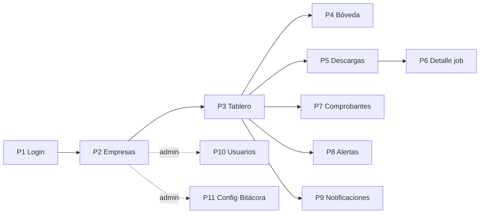

# 09 — Guía del Demo UX (especificación para prototipo externo)

| Campo | Valor |
|---|---|
| Documento | 09 — Guía del Demo UX |
| Versión | 2.0 |
| Fecha | 2026-07-27 |
| Metodología | Demo-First v2.1 **Docs-First**: el demo NO es código en este repo; esta spec se prototipa en herramienta externa (Claude Design) y se traduce a `apps/web` en Fase 2 |
| Depende de | [`01_SRS`](../01-vision/01_SRS_especificacion_requisitos.md) · [`03_modelo_de_datos`](../03-datos/03_modelo_de_datos.md) · [`05_especificacion_api`](../05-api/05_especificacion_api.md) · [`08_design_system`](../01-vision/08_identidad_visual_design_system.md) |

## 1. Propósito y alcance

Valida los flujos del MVP con datos **simulados, sin persistencia y sin PII real** (dominios `@demo.test`, RFC de prueba del SAT, UUID ficticios). Flujos a validar: acceso y permisos por empresa (prioridad 1), alta de e.firma en bóveda (prioridad 1), lanzar y monitorear descargas (prioridad 2), consultar/exportar comprobantes (prioridades 2–3), y atender alertas EFOS/cancelaciones y configurar notificaciones (prioridad 3). Al validar con el stakeholder se congela el contrato `ApiClient` (doc 05 §9).

## 2. Inventario de pantallas

| # | Pantalla | Requisitos SRS | Ruta | Roles |
|---|---|---|---|---|
| P1 | Login | RF-AUTH-01 | `/login` | Todos |
| P2 | Selector / lista de empresas (con estado de e.firma) | RF-AUTH-03, RF-EMP | `/empresas` | Todos |
| P3 | Tablero de empresa (resumen: jobs recientes, alertas, e.firma) | RF-SYNC-03, RF-RIES | `/e/:id` | Todos |
| P4 | Bóveda: alta/estado/reemplazo de e.firma | RF-BOV-01…04 | `/e/:id/efirma` | Operador+ |
| P5 | Descargas: crear (rango/tipo, preview de ventanas) + monitoreo de jobs | RF-DESC, RF-SYNC-01…03 | `/e/:id/descargas` | Operador+ (crear), todos (ver) |
| P6 | Detalle de job (drawer): estados, intentos, mensaje, reintentar | RF-DESC-05, máquina §4 | `/e/:id/descargas/:job` | Operador+ |
| P7 | Comprobantes: listado con filtros, chips de estatus, export | RF-LIST-01/02, RF-VAL | `/e/:id/comprobantes` | Todos |
| P8 | Alertas/eventos: EFOS, cancelaciones tardías, por-vencer | RF-RIES-01/02 | `/e/:id/alertas` | Todos |
| P9 | Notificaciones: destinos y suscripciones | RF-NOT-01 | `/e/:id/notificaciones` | Operador+ |
| P10 | Administración: usuarios y permisos | RF-AUTH-02/03 | `/admin/usuarios` | Admin |
| P11 | Administración: configuración y bitácora | RF-CFG-01, RF-BIT-01 | `/admin/config`, `/admin/bitacora` | Admin |

## 3. Mapa de navegación



Sidebar por empresa (P3–P9) con selector de empresa persistente; módulos admin fuera del contexto de empresa.

## 4. Catálogo de estados por componente

Todos los componentes del doc 08 §5 muestran: default · hover · focus-visible · disabled · loading · **empty** · **error**. Casos clave del demo:

- **P2:** empresa sin e.firma (badge "Sin e.firma" + CTA a P4); empresa inactiva (atenuada, sin acciones); usuario consulta (sin botones mutantes).
- **P4:** formulario vacío → validando → éxito (metadatos de vigencia) → errores `EFIRMA_NO_ABRE` / `RFC_NO_COINCIDE` / `EFIRMA_VENCIDA`; estado "por vencer" (banner warning con días restantes).
- **P5:** preview del troceo ("3 años → 3 ventanas") antes de confirmar; tabla de jobs con chips de los 6 estados; intento de crear con e.firma vencida → error 422 explicado.
- **P6:** job en ERROR con mensaje y botón reintentar (solo operador+); job EN_PROCESO con intentos y última verificación.
- **P7:** filtros combinados; fila con estatus `cancelado` resaltado; export → toast "generando" → descarga; vacío con filtros ("Sin resultados, limpia los filtros").
- **P8:** alerta EFOS con RFC en mono, situación y lista de UUIDs afectados; cancelación tardía con mes original vs mes de cancelación; vacío positivo ("Sin alertas 🎉" no — sin emoji: "Sin alertas activas").
- **Global:** 403 de permiso (pantalla segura "No tienes acceso a esta empresa"), sesión expirada → P1.

## 5. Espejo de datos (db.json embebido — espejo del DDL doc 03)

El prototipo usa exactamente estas claves/columnas (una clave por tabla, enums válidos, FKs consistentes). Escenarios cubiertos: camino feliz, vacío, error, sin-permiso, e.firma por vencer, EFOS y cancelación tardía.

```jsonc
{
  "usuarios": [
    { "usuario_id": 1, "firebase_uid": "mock-admin", "correo": "admin@demo.test", "nombre": "Admin Demo", "rol_global": "admin", "activo": 1 },
    { "usuario_id": 2, "firebase_uid": "mock-op", "correo": "ana@demo.test", "nombre": "Ana Torres", "rol_global": "operador", "activo": 1 },
    { "usuario_id": 3, "firebase_uid": "mock-cons", "correo": "beto@demo.test", "nombre": "Beto Ruiz", "rol_global": "consulta", "activo": 1 }
  ],
  "empresas": [
    { "empresa_id": 7, "nombre": "Comercializadora Demo Norte", "rfc": "EKU9003173C9",
      "plantilla_nomenclatura": "{razon_social}_{folio}_V", "genera_pdf_comprobante": 0, "activo": 1 },
    { "empresa_id": 8, "nombre": "Servicios Empresariales Demo", "rfc": "XAXX010101000",
      "plantilla_nomenclatura": "{razon_social}_{uuid_last4}_V", "genera_pdf_comprobante": 1, "activo": 1 },
    { "empresa_id": 9, "nombre": "Empresa Inactiva Demo", "rfc": "XEXX010101000",
      "plantilla_nomenclatura": "{razon_social}_{folio}_V", "genera_pdf_comprobante": 0, "activo": 0 }
  ],
  "usuario_empresa": [
    { "usuario_id": 2, "empresa_id": 7, "rol": "operador" },
    { "usuario_id": 2, "empresa_id": 8, "rol": "operador" },
    { "usuario_id": 3, "empresa_id": 7, "rol": "consulta" }
  ],
  "efirmas": [
    { "efirma_id": 1, "empresa_id": 7, "num_serie": "30001000000400002325",
      "not_before": "2024-08-01 00:00:00", "not_after": "2028-08-01 00:00:00" },
    { "efirma_id": 2, "empresa_id": 8, "num_serie": "30001000000400009911",
      "not_before": "2022-08-10 00:00:00", "not_after": "2026-08-10 00:00:00" }
  ],
  "jobs": [
    { "job_id": 41, "empresa_id": 7, "tipo": "recibido", "solicitud": "CFDI", "origen": "manual",
      "fecha_inicial": "2025-01-01", "fecha_final": "2025-12-31", "id_solicitud": "d4e5f6a7-0001",
      "estado": "DESCARGADO", "intentos": 3, "paquetes": 2, "mensaje": null,
      "created_at": "2026-07-20 09:00:00", "updated_at": "2026-07-20 11:42:00" },
    { "job_id": 42, "empresa_id": 7, "tipo": "recibido", "solicitud": "CFDI", "origen": "sync",
      "fecha_inicial": "2026-07-01", "fecha_final": "2026-07-26", "id_solicitud": "d4e5f6a7-0002",
      "estado": "EN_PROCESO", "intentos": 5, "paquetes": 0, "mensaje": null,
      "created_at": "2026-07-27 02:00:00", "updated_at": "2026-07-27 08:15:00" },
    { "job_id": 43, "empresa_id": 7, "tipo": "emitido", "solicitud": "CFDI", "origen": "manual",
      "fecha_inicial": "2024-01-01", "fecha_final": "2024-12-31", "id_solicitud": null,
      "estado": "ERROR", "intentos": 8, "paquetes": 0, "mensaje": "Rechazo del SAT: límite de solicitudes en proceso",
      "created_at": "2026-07-25 10:00:00", "updated_at": "2026-07-25 16:20:00" },
    { "job_id": 44, "empresa_id": 8, "tipo": "recibido", "solicitud": "METADATA", "origen": "sync",
      "fecha_inicial": "2026-07-01", "fecha_final": "2026-07-26", "id_solicitud": "a1b2c3-0044",
      "estado": "TERMINADA", "intentos": 2, "paquetes": 1, "mensaje": null,
      "created_at": "2026-07-27 02:00:00", "updated_at": "2026-07-27 03:05:00" }
  ],
  "comprobantes": [
    { "comprobante_id": 1001, "empresa_id": 7, "job_id": 41, "uuid": "AAAA1111-BBBB-2222-CCCC-3333DDDD4444",
      "folio": "4589", "rfc_emisor": "AAA010101AAA", "rfc_receptor": "EKU9003173C9",
      "razon_social_emisor": "Proveedora del Norte Demo", "total": 15080.00,
      "fecha_emision": "2025-03-12 10:30:00", "tipo_comprobante": "I",
      "estatus": "vigente", "estatus_verificado_at": "2026-07-26 02:10:00",
      "xml_path": "e7/2025/AAAA1111.xml", "comprobante_path": null },
    { "comprobante_id": 1002, "empresa_id": 7, "job_id": 41, "uuid": "EEEE5555-FFFF-6666-AAAA-7777BBBB8888",
      "folio": "1234", "rfc_emisor": "BBB020202BB2", "rfc_receptor": "EKU9003173C9",
      "razon_social_emisor": "Insumos Fronterizos Demo", "total": 8920.50,
      "fecha_emision": "2025-05-08 16:05:00", "tipo_comprobante": "I",
      "estatus": "cancelado", "estatus_verificado_at": "2026-07-26 02:10:00",
      "xml_path": "e7/2025/EEEE5555.xml", "comprobante_path": null },
    { "comprobante_id": 1003, "empresa_id": 7, "job_id": 41, "uuid": "9999AAAA-1111-2222-3333-4444BBBB5555",
      "folio": null, "rfc_emisor": "CCC030303CC3", "rfc_receptor": "EKU9003173C9",
      "razon_social_emisor": "Comercial EFOS Demo", "total": 45000.00,
      "fecha_emision": "2024-11-20 12:00:00", "tipo_comprobante": "I",
      "estatus": "vigente", "estatus_verificado_at": "2026-07-26 02:10:00",
      "xml_path": "e7/2024/9999AAAA.xml", "comprobante_path": null }
  ],
  "lista_69b": [
    { "registro_id": 1, "rfc": "CCC030303CC3", "situacion": "definitivo",
      "fecha_publicacion": "2026-07-15", "version_lista": "2026-07-25" }
  ],
  "eventos": [
    { "evento_id": 501, "empresa_id": 7, "tipo": "efos",
      "detalle": { "rfc": "CCC030303CC3", "situacion": "definitivo", "uuids": ["9999AAAA-1111-2222-3333-4444BBBB5555"], "total_afectado": 45000.00 },
      "created_at": "2026-07-26 03:00:00" },
    { "evento_id": 502, "empresa_id": 7, "tipo": "cancelacion_tardia",
      "detalle": { "uuid": "EEEE5555-FFFF-6666-AAAA-7777BBBB8888", "mes_emision": "2025-05", "detectado": "2026-07-26" },
      "created_at": "2026-07-26 03:00:00" },
    { "evento_id": 503, "empresa_id": 8, "tipo": "efirma_por_vencer",
      "detalle": { "not_after": "2026-08-10", "dias_restantes": 14 },
      "created_at": "2026-07-27 02:05:00" }
  ],
  "notificacion_destinos": [
    { "destino_id": 1, "empresa_id": 7, "correo": "conta@demo.test",
      "eventos_suscritos": ["efos", "cancelacion_tardia", "error_descarga"], "activo": 1 }
  ],
  "bitacora": [
    { "bitacora_id": 9001, "actor": "ana@demo.test", "accion": "alta_efirma", "entidad": "empresa:7",
      "detalle": { "num_serie": "30001000000400002325" }, "created_at": "2026-07-19 12:00:00" },
    { "bitacora_id": 9002, "actor": "worker", "accion": "uso_boveda", "entidad": "job:41",
      "detalle": { "empresa_id": 7 }, "created_at": "2026-07-20 09:01:00" }
  ],
  "configuracion": [
    { "clave": "max_meses_ventana", "ejercicio_fiscal": "2026", "valor": 12 },
    { "clave": "umbral_vigencia_dias", "ejercicio_fiscal": "vigente", "valor": 15 },
    { "clave": "hora_sync", "ejercicio_fiscal": "vigente", "valor": "02:00" }
  ]
}
```

## 6. Interfaz de datos del prototipo

El prototipo consume los datos **exclusivamente** a través de la interfaz `ApiClient` del doc 05 §9 (copiada al prototipo tal cual); las pantallas nunca leen el JSON directo. Ese contrato es lo que se congela tras la validación.

## 7. Accesibilidad (WCAG 2.1 AA — checklist del prototipo)

- [ ] Combinaciones de color solo del doc 08 §2.4; contraste ≥ 4.5:1.
- [ ] Estado siempre con chip (ícono + texto), nunca solo color.
- [ ] Navegación completa por teclado; foco visible; modal/drawer con trampa de foco y `Esc`.
- [ ] Labels y errores asociados en formularios (crítico en P4 e.firma).
- [ ] Jerarquía de encabezados válida; tablas con `<th scope>`; RFC/UUID en mono.

## 8. Responsive

- **≥1280:** sidebar expandido + tabla + drawer lateral persistente.
- **1024–1279:** drawer superpuesto; sidebar colapsable.
- **768–1023:** sidebar colapsado (íconos); filtros en acordeón.
- **<640:** tablas → tarjetas apiladas (P5/P7); acciones primarias como botón de ancho completo; P4 en una columna.

## 9. Protocolo de validación

Sesión con David (+ Pedro si D1/D2 se discuten en vivo): (1) login como Ana (operadora) → recorrer P2→P3→P4 alta de e.firma con error y éxito; (2) crear descarga de 3 años y revisar preview de ventanas + monitoreo con los 4 estados del seed; (3) reintentar el job 43 en ERROR; (4) filtrar comprobantes por cancelados, exportar; (5) revisar alertas EFOS/cancelación tardía y configurar un destino de notificación; (6) login como Beto (consulta) → verificar que no ve acciones mutantes ni la empresa 8; (7) login como Admin → usuarios/permisos, config y bitácora. Registrar cada hallazgo en §10.

## 10. Bitácora hallazgos → cambios

| # | Hallazgo | Doc afectado (01/05/08/09) | Cambio | Estado |
|---|---|---|---|---|
| — | *(se llena durante la validación)* | | | |

**Cierre de Fase 1:** hallazgos resueltos → re-sincronizar SRS (01) y API (05) → marcar el contrato `ApiClient` como **CONGELADO** → actualizar tabla de Estado de fase en README/CLAUDE.
